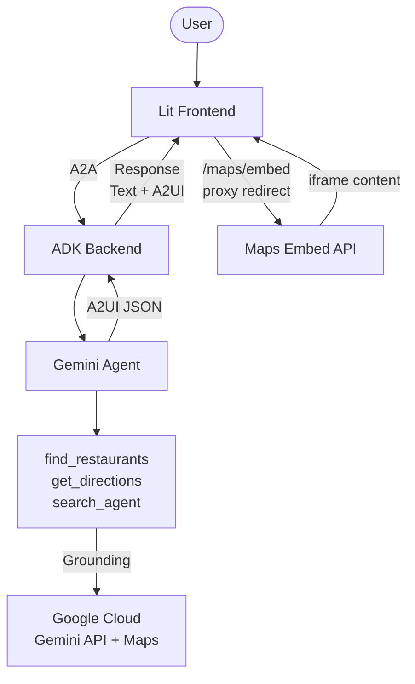
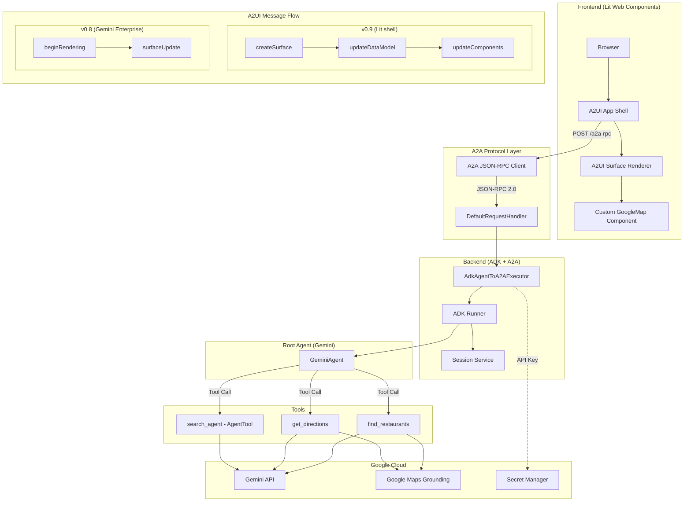
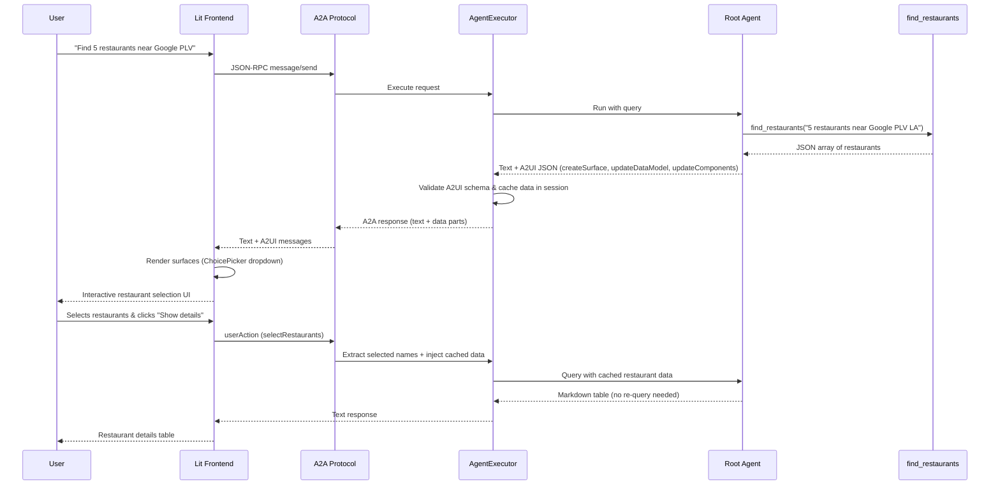

# A2UI Restaurant Finder Demo

An AI-powered restaurant finder agent built with Google ADK (Agent Development Kit) and the A2A (Agent-to-Agent) protocol, featuring a rich interactive UI powered by [A2UI](https://github.com/google/A2UI) — serving **v0.9** to a custom Lit shell and **v0.8** to Gemini Enterprise (GE) from a single backend.

## Table of Contents
- [System Description](#system-description)
- [High-Level Architecture](#high-level-architecture)
- [Detailed Architecture](#detailed-architecture)
- [Data Flow](#data-flow)
- [Project Structure](#project-structure)
- [Requirements](#requirements)
- [Private Package Registry](#private-package-registry)
- [Local Testing](#local-testing)
- [Cloud Deployment](#cloud-deployment)
- [Commands Reference](#commands-reference)
- [Key Technologies](#key-technologies)

## System Description

This application demonstrates a full-stack AI agent architecture where:

- A **Gemini-powered root agent** orchestrates multiple tools to find restaurants, get directions, and look up locations using Google Maps grounding.
- The backend communicates via the **A2A protocol** (JSON-RPC), allowing interoperability with any A2A-compatible client.
- The same backend serves **two A2UI versions** simultaneously. The active version is selected per-request from the client's `X-A2A-Extensions` header: the custom Lit shell sends `…/v0.9` and gets v0.9; Gemini Enterprise sends no A2UI header and falls back to v0.8 (which it natively renders).
- The Lit shell uses the v0.9 **save-then-render** pattern (`updateDataModel` then `updateComponents`) for data reuse across conversation turns. The v0.8 path uses `beginRendering` + `surfaceUpdate` with inline component data.
- Custom **WebFrameUrl** and **GoogleMap** components are defined in both v0.8 and v0.9 catalogs and shipped inline, so map and directions surfaces render natively in GE and the Lit shell using the Google Maps Embed API.

## High-Level Architecture



## Detailed Architecture



## Data Flow



## Project Structure

```
agent-a2ui-demo/
├── app/                        # Backend agent code
│   ├── agent.py                # Root agent with A2UI instructions
│   ├── agent_executor.py       # A2A executor with A2UI validation & caching
│   ├── main.py                 # Uvicorn entry point, serves frontend + A2A
│   ├── tools.py                # find_restaurants, get_directions (Google Maps grounding)
│   ├── sub_agents.py           # search_agent (AgentTool with GoogleSearchTool)
│   ├── catalog_schemas/        # A2UI catalog definitions (JSON Schema)
│   │   ├── 0.8/                # v0.8 catalog with GoogleMap, WebFrameUrl, etc. (for GE)
│   │   └── 0.9/                # v0.9 catalog with GoogleMap, WebFrameUrl, etc. (for Lit shell)
│   └── examples/               # A2UI example templates for the LLM
│       └── restaurant_finder_catalog/
│           ├── 0.8/            # v0.8 examples (map.json, directions.json, restaurant_selection.json)
│           └── 0.9/            # v0.9 examples (map.json, directions.json, restaurant_selection.json)
├── frontend/                   # Lit-based A2UI client
│   ├── src/
│   │   ├── app.ts              # Main A2UI shell with chat UI
│   │   ├── client.ts           # A2A JSON-RPC client
│   │   └── google-map-component.ts  # Custom GoogleMap + WebFrameUrl components
│   ├── index.html
│   ├── package.json
│   └── vite.config.ts
├── lit_internal/               # GoogleMap component for GE integration
├── tests/                      # Unit, integration, and eval tests
├── deployment/                 # Terraform infrastructure
├── .cloudbuild/                # CI/CD pipeline configurations
├── Makefile                    # Development commands
└── pyproject.toml              # Python dependencies
```

## Requirements

- **uv**: Python package manager - [Install](https://docs.astral.sh/uv/getting-started/installation/)
- **Node.js**: For frontend build (v18+)
- **Google Cloud SDK**: For GCP services - [Install](https://cloud.google.com/sdk/docs/install)
- **Google Cloud Project** with the following APIs enabled:
  - Vertex AI API
  - Secret Manager API
  - Google Maps Platform (Maps Embed API)
- **Google Maps API Key** stored in Secret Manager as `google_map_api_key`:
  ```bash
  # Create the secret (one-time setup)
  echo -n "YOUR_MAPS_API_KEY" | gcloud secrets create google_map_api_key --data-file=-

  # Or for local dev, add to .env instead:
  echo 'GOOGLE_MAPS_API_KEY=YOUR_MAPS_API_KEY' >> .env
  ```

## Private Package Registry

By default, this project resolves all Python packages from [PyPI](https://pypi.org). If you are working in an environment that requires a private Artifact Registry (e.g., Google Cloudtop), add the following to `pyproject.toml`:

```toml
[[tool.uv.index]]
name = "ah-3p-staging-python"
url = "https://us-python.pkg.dev/artifact-foundry-prod/ah-3p-staging-python/simple/"
```

Then regenerate the lockfile:

```bash
rm uv.lock && uv lock
```

> [!WARNING]
> The `uv.lock` file pins download URLs to whichever registry was used during `uv lock`. A lockfile generated against the private registry will fail in environments without registry credentials (e.g., Docker/Cloud Build), and vice versa. Always regenerate the lockfile when switching registries.

## Local Testing

### 1. Set up environment

```bash
# Install Python dependencies
make install

# Set your GCP project
gcloud config set project <your-project-id>
gcloud auth application-default login

# Copy .env.example and fill in your details
cp .env.example .env
```

Edit the `.env` file to set your `GOOGLE_CLOUD_PROJECT` and `GOOGLE_CLOUD_LOCATION`.

> [!IMPORTANT]
> A `.env` file is required for local testing to specify your Google Cloud Project. Without it, the application may fall back to the Public API or use default locations (like `global`) that might return a `404 Not Found` error if the model is not available in that region for Vertex AI.


### 2. Build frontend and run backend

```bash
# Build the frontend (one-time, or after frontend changes)
make frontend-build

# Start the backend (serves frontend + A2A endpoint)
make local-backend PORT=8080
```

The app will be available at `http://localhost:8080`.


## Cloud Deployment

### Deploy to Cloud Run

```bash
# Set project
gcloud config set project <your-project-id>

# Deploy
make deploy
```

### Set up CI/CD and infrastructure (Optional)

```bash
# One-command CI/CD pipeline setup
uvx agent-starter-pack setup-cicd

# Or set up dev environment with Terraform
make setup-dev-env
```

### Register with Gemini Enterprise

```bash
make register-gemini-enterprise
```

## Commands Reference

| Command | Description |
|---------|-------------|
| `make install` | Install Python dependencies |
| `make frontend-build` | Build frontend for production |
| `make frontend-dev` | Launch frontend dev server with hot-reload |
| `make local-backend` | Launch backend server (serves built frontend) |
| `make playground` | Launch ADK development playground |
| `make inspector` | Launch A2A Protocol Inspector |
| `make deploy` | Deploy to Cloud Run |
| `make test` | Run unit and integration tests |
| `make lint` | Run code quality checks |
| `make eval` | Run agent evaluation |
| `make setup-dev-env` | Set up dev environment with Terraform |

## Key Technologies

- **[Google ADK](https://google.github.io/adk-docs/)** — Agent Development Kit for building AI agents
- **[A2A Protocol](https://a2aprotocol.ai/)** — Agent-to-Agent interoperability protocol
- **[A2UI](https://github.com/google/A2UI)** — Agent-driven UI specification (v0.8 + v0.9)
- **[Lit](https://lit.dev/)** — Web component framework for the frontend
- **[Gemini](https://ai.google.dev/)** — Google's LLM powering the agent
- **[Google Maps Platform](https://developers.google.com/maps)** — Maps grounding and embed API
