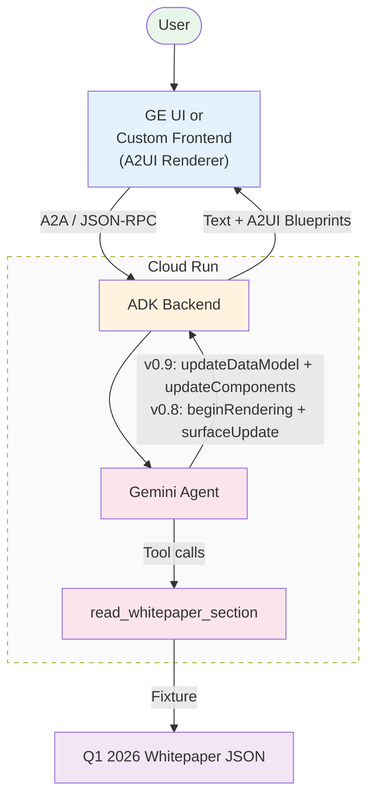
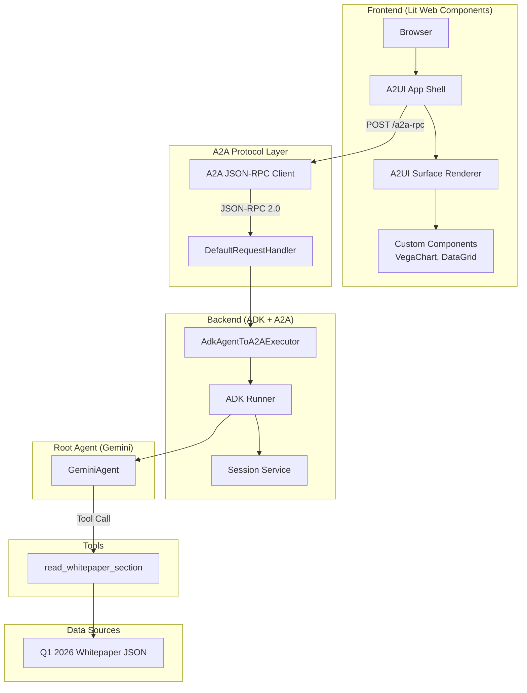
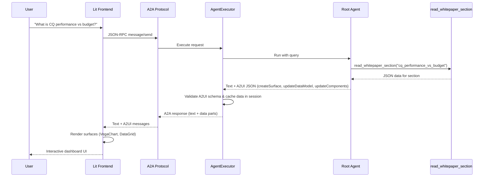

# A2UI Dashboard Agent Demo

An AI-powered dashboard agent built with Google ADK (Agent Development Kit) and the A2A (Agent-to-Agent) protocol, featuring a rich interactive UI powered by [A2UI](https://github.com/google/A2UI) — serving **v0.9** to a custom Lit shell and **v0.8** to Gemini Enterprise (GE) from a single backend.

## System Description

This application demonstrates a full-stack AI agent architecture where:

- A **Gemini-powered root agent** orchestrates tools to fetch sales data from a Q1 2026 whitepaper fixture and render interactive dashboards.
- The backend communicates via the **A2A protocol** (JSON-RPC), allowing interoperability with any A2A-compatible client.
- The same backend serves **two A2UI versions** simultaneously. The active version is selected per-request from the client's `X-A2A-Extensions` header: the custom Lit shell sends `…/v0.9` and gets v0.9; Gemini Enterprise sends no A2UI header and falls back to v0.8 (which it natively renders).
- The agent renders 7 specialized IBM dashboards using **VegaChart** and **DataGrid** components.

## High-Level Architecture



## Detailed Architecture



## Data Flow



## Project Structure

```
agent-a2ui-demo/
├── app/                        # Backend agent code
│   ├── agent.py                # Root agent with A2UI instructions
│   ├── agent_executor.py       # A2A executor with A2UI validation & caching
│   ├── main.py                 # Uvicorn entry point, serves frontend + A2A
│   ├── tools.py                # read_whitepaper_section
│   ├── catalog_schemas/        # A2UI catalog definitions (JSON Schema)
│   │   ├── 0.8/                # v0.8 catalog with VegaChart, DataGrid, etc.
│   │   └── 0.9/                # v0.9 catalog with VegaChart, DataGrid, etc.
│   └── examples/               # A2UI example templates for the LLM
│       └── restaurant_finder_catalog/
│           ├── 0.8/            # v0.8 examples (dashboard_*.json)
│           └── 0.9/            # v0.9 examples (dashboard_*.json)
├── frontend/                   # Lit-based A2UI client
│   ├── src/
│   │   ├── app.ts              # Main A2UI shell with chat UI
│   │   ├── client.ts           # A2A JSON-RPC client
│   │   ├── vega-chart-component.ts  # Custom VegaChart component
│   │   └── data-grid-component.ts   # Custom DataGrid component
│   ├── index.html
│   ├── package.json
│   └── vite.config.ts
├── tests/                      # Unit, integration, and eval tests
├── deployment/                 # Terraform infrastructure
├── Makefile                    # Development commands
└── pyproject.toml              # Python dependencies
```

## Requirements

- **uv**: Python package manager
- **Node.js**: For frontend build (v18+)
- **Google Cloud SDK**: For GCP services

## Local Testing

### 1. Set up environment

```bash
# Install Python dependencies
make install

# Set your GCP project
gcloud config set project <your-project-id>
gcloud auth application-default login

# Copy .env.example and fill in your details
cp .env.example .env
```

### 2. Build frontend and run backend

```bash
# Build the frontend (one-time, or after frontend changes)
make frontend-build

# Start the backend (serves frontend + A2A endpoint)
make local-backend PORT=8080
```

The app will be available at `http://localhost:8080`.

## Key Technologies

- **[Google ADK](https://google.github.io/adk-docs/)** — Agent Development Kit for building AI agents
- **[A2A Protocol](https://a2aprotocol.ai/)** — Agent-to-Agent interoperability protocol
- **[A2UI](https://github.com/google/A2UI)** — Agent-driven UI specification (v0.8 + v0.9)
- **[Lit](https://lit.dev/)** — Web component framework for the frontend
- **[Gemini](https://ai.google.dev/)** — Google's LLM powering the agent
- **[Vega](https://vega.github.io/vega/)** — Visualization grammar for charts
