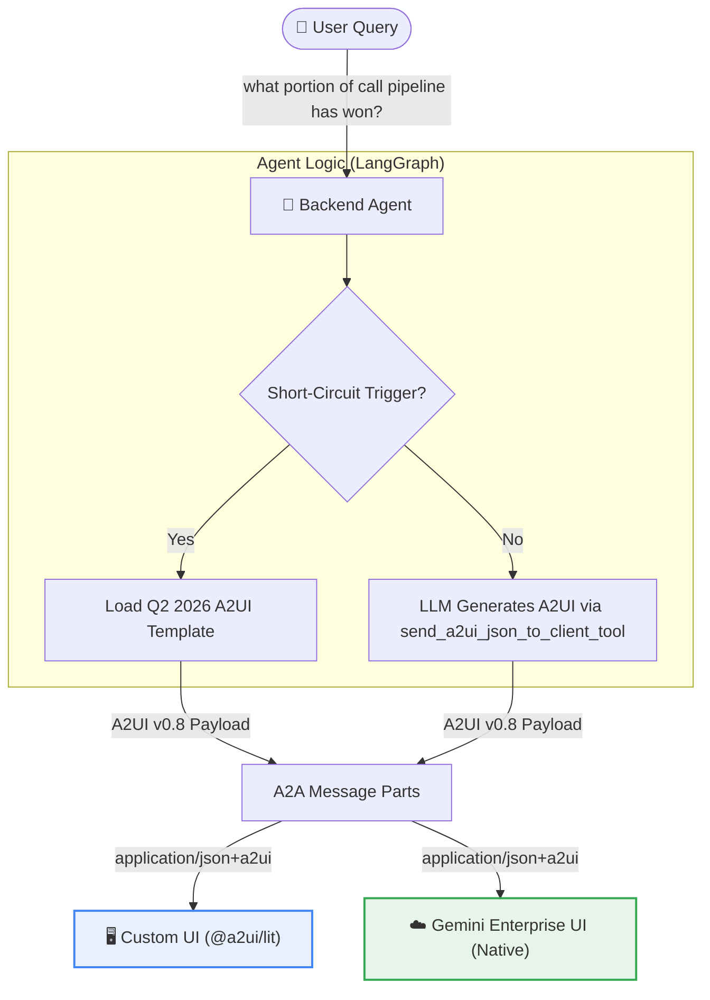

# 📋 A2UI Response Enrichment & Thinking-Progress Implementation

This document covers two related pieces of work that together make pipeline
queries (e.g. *"what portion of call pipeline has won?"*) feel premium across
both the **Custom UI** and the **Gemini Enterprise (GE) UI**:

1. **Response enrichment** — returning rich interactive A2UI components (KPI
   counters, Vega-Lite donut charts, insight cards) for the answer itself.
2. **Real-time thinking steps & tool-call progress** — a live "Thinking"
   widget that narrates the agent's reasoning step by step, with each step's
   tool calls and a **per-step progress bar** nested beneath it.

> Status: Phase 1 (template) and Phase 2 (route + thinking/progress widget) are
> implemented. Phase 2's thinking widget is documented in detail below and is
> the authoritative reference for `_tool_progress_messages()` in
> `app/agent_executor.py`.

---

## 🔍 Context & Architecture

Because A2UI is a **declarative, framework-agnostic protocol**, the frontend
rendering layers (both the Custom Lit Web Components and the built-in GE UI
renderer) automatically know how to draw standard A2UI catalog items once
received. The **response enrichment** therefore needs **no client-side
changes** — it is confined to the backend agent.

The **thinking/progress widget** is likewise just an ordinary A2UI surface, so
it renders in both UIs. It does require small frontend additions to *stream*
the widget live during a request (see [Frontend integration](#frontend-integration)).



---

## 🛠️ Phase 1: A2UI Template Configuration

A dedicated template represents the Q2 2026 call pipeline conversion status.

1. **File Creation**: Save the file (repo-relative) as
   `app/examples/a2ui_demo_catalog/0.8/dashboard_q2_2026_call_pipeline.json`.
2. **Components Tree**:
   * **Root Column**: Lays out the sections vertically.
   * **Header Card**: Title `"Q2 2026 Call Pipeline Status"` and subtitle
     `"Breakdown of Won vs. Remaining Pipeline Value"`.
   * **KPI Row**: Two side-by-side cards showing the key metrics:
     * **Won**: `39.6%`
     * **Remaining**: `60.4%`
   * **Chart Card**: A `VegaChart` component holding the Vega-Lite donut spec.
   * **Insight Card**: Encapsulates the natural-language summary.

### A2UI JSON Blueprint Specification
```json
[
  {
    "beginRendering": {
      "surfaceId": "call-pipeline-conversion-widget",
      "root": "root"
    }
  },
  {
    "surfaceUpdate": {
      "surfaceId": "call-pipeline-conversion-widget",
      "components": [
        {
          "id": "root",
          "component": {
            "Column": {
              "children": {
                "explicitList": [
                  "header-card",
                  "kpi-row",
                  "chart-card",
                  "insight-card"
                ]
              },
              "alignment": "stretch"
            }
          }
        },
        {
          "id": "header-card",
          "component": {
            "Card": { "child": "header-col" }
          }
        },
        {
          "id": "header-col",
          "component": {
            "Column": {
              "children": {
                "explicitList": ["title", "subtitle"]
              },
              "alignment": "start"
            }
          }
        },
        {
          "id": "title",
          "component": {
            "Text": {
              "text": { "literalString": "Q2 2026 Call Pipeline Status" },
              "usageHint": "h2"
            }
          }
        },
        {
          "id": "subtitle",
          "component": {
            "Text": {
              "text": { "literalString": "Breakdown of Won vs. Remaining Pipeline Value" },
              "usageHint": "caption"
            }
          }
        },
        {
          "id": "kpi-row",
          "component": {
            "Row": {
              "children": {
                "explicitList": ["kpi-won", "kpi-remain"]
              },
              "distribution": "spaceBetween"
            }
          }
        },
        {
          "id": "kpi-won",
          "component": {
            "Card": { "child": "kpi-won-col" }
          }
        },
        {
          "id": "kpi-won-col",
          "component": {
            "Column": {
              "children": {
                "explicitList": ["kpi-won-label", "kpi-won-value"]
              }
            }
          }
        },
        {
          "id": "kpi-won-label",
          "component": {
            "Text": {
              "text": { "literalString": "Pipeline Won" },
              "usageHint": "caption"
            }
          }
        },
        {
          "id": "kpi-won-value",
          "component": {
            "Text": {
              "text": { "literalString": "39.6%" },
              "usageHint": "h1"
            }
          }
        },
        {
          "id": "kpi-remain",
          "component": {
            "Card": { "child": "kpi-remain-col" }
          }
        },
        {
          "id": "kpi-remain-col",
          "component": {
            "Column": {
              "children": {
                "explicitList": ["kpi-remain-label", "kpi-remain-value"]
              }
            }
          }
        },
        {
          "id": "kpi-remain-label",
          "component": {
            "Text": {
              "text": { "literalString": "Remaining" },
              "usageHint": "caption"
            }
          }
        },
        {
          "id": "kpi-remain-value",
          "component": {
            "Text": {
              "text": { "literalString": "60.4%" },
              "usageHint": "h1"
            }
          }
        },
        {
          "id": "chart-card",
          "component": {
            "Card": { "child": "donut-chart" }
          }
        },
        {
          "id": "donut-chart",
          "component": {
            "VegaChart": {
              "spec": {
                "$schema": "https://vega.github.io/schema/vega-lite/v5.json",
                "data": {
                  "values": [
                    { "label": "Won", "value": 39.6 },
                    { "label": "Remaining", "value": 60.4 }
                  ]
                },
                "mark": { "type": "arc", "innerRadius": 50, "outerRadius": 80 },
                "encoding": {
                  "theta": { "field": "value", "type": "quantitative" },
                  "color": {
                    "field": "label",
                    "type": "nominal",
                    "scale": {
                      "domain": ["Won", "Remaining"],
                      "range": ["#34A853", "#a8a8a8"]
                    }
                  }
                }
              }
            }
          }
        },
        {
          "id": "insight-card",
          "component": {
            "Card": { "child": "insight-text" }
          }
        },
        {
          "id": "insight-text",
          "component": {
            "Text": {
              "text": {
                "literalString": "According to AskEPM, approximately 39.6% of the call pipeline value for Q2 2026 has been won, leaving 60.4% remaining to close."
              },
              "usageHint": "body"
            }
          }
        }
      ]
    }
  }
]
```

---

## 🛠️ Phase 2: Backend Route & Real-Time Thinking / Progress

### 2.1 Route Trigger Registration
Open `app/agent.py` and update the `_TRIGGERS` dictionary mapping query text to
the new template path:
```diff
 _TRIGGERS = {
     ...
     "which ut15s are underperforming against their saas budget": "dashboard_ut15_and_regional_cq.json",
     "cq performance by region": "dashboard_ut15_and_regional_cq.json",
-    "what portion of call pipeline has won": "dashboard_call_pipeline_conversion.json",
-    "call pipeline conversion": "dashboard_call_pipeline_conversion.json",
+    "what portion of call pipeline has won": "dashboard_q2_2026_call_pipeline.json",
+    "what portion of call pipeline has won?": "dashboard_q2_2026_call_pipeline.json",
+    "call pipeline conversion": "dashboard_q2_2026_call_pipeline.json",
 }
```

### 2.2 Thinking Steps & Tool-Call Progress Widget

> The original plan emitted plain-string `update_status(message="...")` stages.
> The implemented design (below) is richer: a single re-rendered A2UI surface
> showing an ordered checklist of thinking steps, the tool calls each step
> issued nested beneath it, and a **per-step progress bar**. This section is the
> authoritative reference.

The agent surfaces its reasoning as a live **"Thinking" widget** — an ordered
checklist of thinking steps, with the tool calls each step issued nested
beneath it and a per-step progress bar that tracks tool-call completion.

The whole widget is an ordinary A2UI surface, so it renders identically in the
custom UI and the GE native renderer. It is re-emitted on every tick (keyed by
a stable `surfaceId`) so the renderer updates it in place rather than
appending.

#### At a glance

```
Thinking
Complete

✓ Checking security & permissions
    Verified user is authorized for the AskIBM sales workspace...

✓ Loaded precompiled dashboard
    Matched a saved template and returned its A2UI blueprint.
    ↳ ✓ Render dashboard UI
    Tool calls · 1/1
    ████████████████████  100%
```

Each step that issued tool calls gets its **own** bar directly beneath its
tool list. Steps with no tools (e.g. the security gate) get no bar.

#### Data model

Progress is driven by an ordered list of `steps`, built up as the LangGraph
graph executes. Each step is a plain dict:

```python
{
    "title": str,  # short headline, e.g. "Loaded precompiled dashboard"
    "detail": str,  # one-line explanation shown as caption
    "state": str,  # "pending" | "active" | "done" | "failed"
    "tools": [{"name": str, "state": "running" | "done" | "failed"}, ...],  # tool calls this step issued
}
```

- **Thinking steps** narrate the process; their state drives the step glyph and
  the subtitle.
- **Tool calls** are the only thing the progress bars count — thinking steps
  themselves never move a bar.

#### Glyphs (pure Unicode, no icon font)

| Kind | State    | Glyph |
|------|----------|-------|
| Step | done     | `✓`   |
| Step | active   | `▸`   |
| Step | pending  | `○`   |
| Step | failed   | `✗`   |
| Tool | running  | `•`   |
| Tool | done     | `✓`   |
| Tool | failed   | `✗`   |

The bar itself is built from Unicode block elements (`█` filled, `░` empty,
`▓` for the failed variant), which share an advance width even in proportional
fonts, so a single A2UI `Text` component renders as a bar — no custom element
or chart re-embed required.

#### Visual nesting (why indentation, not Card chrome)

The frontend renders A2UI with an **empty theme** (`EMPTY_THEME` in
`frontend/src/app.ts`, e.g. `Card: {}`), so `Card` draws no border/background
and `Column` adds no indentation — every component stacks as a plain block.
Wrapping each step in a `Card` is therefore semantically correct but produces
**no visible grouping** on its own.

To make a step's sub-lines (detail, tool calls, progress bar) read as nested
*under* its title, each sub-line is prefixed with `_INDENT` — four
**non-breaking spaces** (` `). NBSP is required because `Text` renders
through markdown: ordinary leading spaces collapse, and four ordinary leading
spaces would be parsed as a code block. NBSP survives in both the custom UI and
the GE native renderer with no theme/CSS dependency, consistent with the
widget's pure-text design.

```
✓ Loaded precompiled dashboard
    Matched a saved template and returned its A2UI blueprint.
    ↳ ✓ Render dashboard UI
    Tool calls · 1/1
    ████████████████████  100%
```

#### Key functions (`app/agent_executor.py`)

| Function | Responsibility |
|----------|----------------|
| `_progress_bar_text(pct, *, failed=False)` | Render the 20-cell text bar, e.g. `██████░░░░░░░░░░  30%`. Clamps to 0–100. |
| `_prettify_tool(name)` | Map a tool name to a friendly label (`send_a2ui_json_to_client_tool` → `Render dashboard UI`), falling back to a humanized name. |
| `_tool_progress(steps)` | Cross-step `(done, total, pct)` aggregate. Retained for reuse/testing; not used by the widget after the move to per-step bars. |
| `_tool_progress_messages(surface_id, steps, *, include_begin, done, failed)` | Build the A2UI messages for the whole widget (Card → Column of Text components). |
| `_emit_progress_status(...)` | Wrap the messages in a `TaskState.working` status update via the `TaskUpdater`. |
| `_node_step(node_name, values)` | Map a completed LangGraph node (`short_circuit`, `model`, `tools`) to a `(title, detail)` step. |

#### Widget structure emitted by `_tool_progress_messages`

Each step is wrapped in its **own** `Card` (→ `Column`) so the step's detail,
tool calls, and progress bar are visibly grouped together — there is no
ambiguity about which step a tool call or bar belongs to.

```
Card  progress-root
└─ Column  progress-col (alignment: stretch)
   ├─ Text  th-title       "Thinking"            (h3)
   ├─ Text  th-subtitle    active step / state   (caption)
   └─ per step idx:
       Card  th-step-card-{idx}
       └─ Column  th-step-col-{idx} (alignment: stretch)
          ├─ Text  th-step-{idx}          "<glyph> <title>"   (body)
          ├─ Text  th-detail-{idx}        detail              (caption, if any)
          ├─ per tool jdx:
          │   └─ Text th-tool-{idx}-{jdx} "↳ <glyph> <label>" (caption)
          └─ if step has tools:
              ├─ Text th-toolbar-label-{idx}  "Tool calls · done/total" (caption)
              └─ Text th-toolbar-{idx}        progress bar              (body)
```

The subtitle reads `Failed` / `Complete` / the active step title / `Working`,
depending on the `failed` / `done` flags and step states. Sub-lines (detail,
tool, label, bar) are prefixed with `_INDENT`.

#### Per-step bar semantics

For each step that issued tool calls:

- `step_done` = count of that step's tools in state `done`.
- `step_pct` = `round(step_done / len(tools) * 100)`.
- `step_failed` = the global `failed` flag **or** any tool in the step is
  `failed` → renders the bar with the `▓` glyph.

This replaced the earlier design that showed a single aggregate bar at the
bottom of the widget.

#### Lifecycle (executor flow)

The graph is streamed instead of `ainvoke`d so progress reflects real node
execution:

```python
graph = self._agent.get_langgraph_graph()
result = None
async for mode, chunk in graph.astream(
    cast(AgentState, initial_state),
    stream_mode=["updates", "values"],
):
    if mode == "values":
        result = chunk  # last "values" chunk is the final result
        continue
    for node_name, values in chunk.items():
        ...  # map node -> step, advance bars, _emit()
```

1. **Intro step** — a scripted "Checking security & permissions" step is
   appended `active` and the surface is created (`include_begin=True`). It has
   no tools, so no bar.
2. **Graph streaming** — `stream_mode=["updates", "values"]`:
   - `values` chunks carry the accumulated state; the last one is the final
     result.
   - `updates` chunks tell us which node finished. `_node_step` produces the
     step title/detail, the previously-active step is marked `done`, and any
     tool calls on the node's last message are recorded as `running`.
   - When the `tools` node runs, any `running` tool calls flip to `done`,
     advancing the relevant per-step bar (no new thinking step is added).
3. **Completion** — every step is marked `done`, any lingering `running` tools
   are resolved to `done` (covers the short-circuit path whose A2UI tool call
   is fulfilled directly), and a final `done=True` tick is emitted. This last
   `working` event is the widget state that stays on the finished message.
4. **Failure** — on exception, active steps and running tools flip to
   `failed`, a `failed=True` tick is emitted, and the task is marked failed
   with an error message part.

#### GE vs Custom UI — avoiding duplicate thinking windows

Each `working` status update can carry two things: a **`TextPart`** (per-tick
narration) and the **A2UI progress surface**. The two clients consume them
differently:

| Client | `TextPart` | A2UI progress surface |
|--------|-----------|-----------------------|
| Custom UI | feeds the (hidden) reasoning-panel fallback | renders the rich in-place widget — the live bar |
| GE | renders in its **native, append-only** thinking panel | renders as a **separate** in-place widget card |

Sending both to GE therefore yields **two** "thinking" displays. A further
wrinkle: GE's native panel **accumulates** every status message (each `working`
update is shown as its own thought), so re-emitting an evolving checklist block per tick
would stack duplicate, growing snapshots. We handle both with client routing
plus a transition-based single-line text progress strategy:

- The custom UI tags its A2A message with `metadata: { a2uiProgress: true }`
  (`frontend/src/client.ts`).
- `execute()` reads `context.message.metadata`; `include_a2ui_progress` is true
  only for that tag.
- `_progress_status_parts(..., include_a2ui=...)`:
  - **custom UI** → `TextPart` (plain stage narration) **+** the A2UI progress
    surface, emitted **every tick** (its widget re-renders in place).
  - **GE / other** → **text-only**, formatting each stage as a single-line status
    message with its respective progress percentage:
    * *In-progress steps:* `▸ [Step Title]... ([Percentage]%)`
    * *Completion state:* `✓ Complete (100%)`
    * *Failure state:* `✗ Failed`
- **Monotonicity & Deduplication:** To ensure the append-only panel displays clean progress, the `_emit` closure in `execute()` tracks:
  1. `last_native_pct` to clamp progress percentages monotonically upward (e.g. preventing a regression from 70% to 50% in loops).
  2. `last_emitted_text` to deduplicate sequential logs in the event of repeated node executions.

Result: the custom UI keeps its live in-place widget; GE shows a clean, chronological log of thoughts:

```
[System spinner: Thinking...]
▸ Checking security & permissions... (10%)
▸ Consulting the whitepaper... (35%)
▸ Compiling dashboard... (70%)
✓ Complete (100%)
```

#### Frontend integration

- **`frontend/src/client.ts`** — `send()` invokes `onA2UIMessage` for A2UI data
  parts arriving in the `working` state, so progress surfaces stream live.
  A shared `#extractA2UIMessages()` helper parses data parts (string or array).
  `failed` task-state text is captured and thrown so `send()` rejects.
- **`frontend/src/app.ts`** — `processLiveA2UI()` feeds streamed surfaces into
  the processor and tracks them in `activeSurfaceIds`. `renderActivity()` shows
  the progress widget live during the request and pins it to the finished
  message via `progressSurfaceIds`, falling back to the collapsible
  "Thought for N steps" reasoning panel when there is no progress surface.

#### Tests

`tests/unit/agent_executor_test.py` covers:

- `_progress_bar_text` — empty/full, clamping/rounding, failed glyph.
- `_tool_progress` — counts only tool calls; zero when there are no tools.
- `_tool_progress_messages` — `beginRendering` only when requested, step/tool
  glyphs, per-step bar counts (a step with no tools emits no bar; a step with a
  running tool shows `Tool calls · 0/1`; a completed step shows `1/1` at 100%),
  NBSP-indented sub-lines, and subtitle states.

---

## 🛠️ Phase 3: Verification & Testing

### 1. Local Sandbox Testing (Custom UI)
* Spin up the local web application server:
  ```bash
  npm run dev
  ```
* Input the query `"what portion of call pipeline has won?"` into the chat
  input field.
* **Progressive Verification**: Verify the Thinking widget updates in place as
  the backend executes — steps flip from `▸` to `✓`, tool calls appear nested
  under their step, and the per-step bar fills to `100%`.
* Verify the answer A2UI surface is correctly instantiated and the Vega chart
  draws without layout shifting or console errors.
* **Restart note**: because the widget markup is generated server-side, restart
  the backend after changing `_tool_progress_messages()` so the new output is
  served.

### 2. Gemini Enterprise (GE) Integration Sandbox
* Synchronize the new agent metadata and capabilities configuration with Google
  Cloud:
  ```bash
  make register-gemini-enterprise
  ```
* Access the AskIBM workspace inside the GE portal.
* Verify the thinking progression and per-step progress bars adapt to the
  native GE collapsible reasoning panel in real time (the pure-text bar and
  NBSP indentation render without any GE theme dependency).
