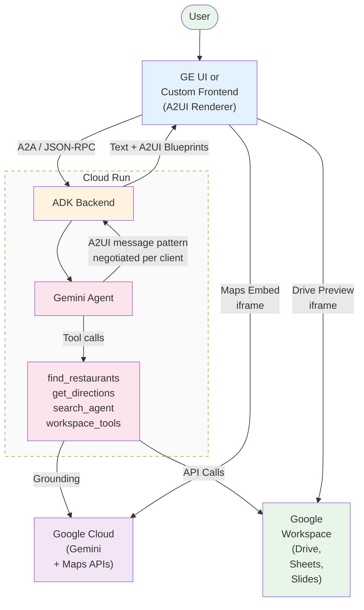
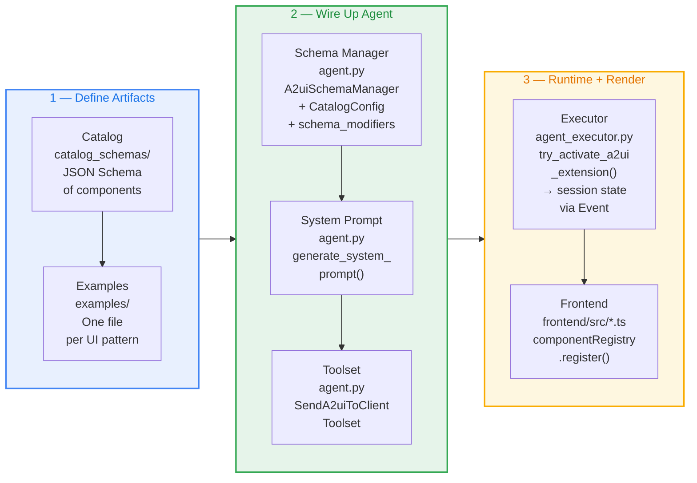
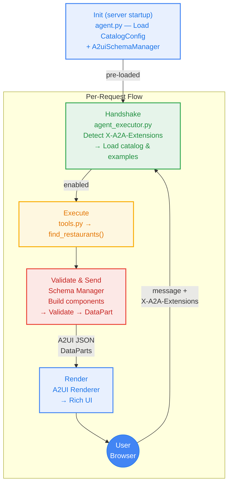

# A developer's guide to Gemini Enterprise and A2UI integration

April 2026. Audience: developers building agents on Google Cloud.

If you've built a chatbot, you know this conversation:

> **User:** "Book a table for two tomorrow at 7pm."
> **Agent:** "Okay, for what day?"
> **User:** "Tomorrow."
> **Agent:** "What time?"

A date picker would have ended this in one tap. But until recently, agents had no standard way to render a date picker — or a map, or a multi-select list — inside the chat surface they live in. They could only return text.

Today, we're walking through how to fix that with **A2UI**, an open protocol for agent-driven user interfaces, and how to integrate an A2UI-enabled agent with **Gemini Enterprise** so the same agent renders rich UI in the GE chat surface and in your own custom frontend. We'll use a working restaurant-finder agent — built with the Google Agent Development Kit (ADK), the A2A protocol, and Gemini — as the reference. The full source is on [GitHub](https://github.com/wadave/agent-a2ui-demo) and there's a [3-minute demo video](https://youtu.be/_5AaYwyqVio).

## The problem: agents speak text, but users want UI

Most agent frameworks today return strings. That's fine for short answers, but it breaks down quickly:

- **Multi-turn slot filling** (date, time, party size) burns turns and patience.
- **Choices among options** (which restaurant? which insurance plan?) become long bulleted lists the user has to copy-paste back.
- **Spatial information** (locations, routes, floor plans) is reduced to addresses.

Developers have tried to patch this by sending HTML or JavaScript fragments, but that introduces real risks: cross-site scripting, UI injection from a remote agent you don't fully control, and visual drift from the host app's design system. What's needed is a way to transmit UI that's **safe like data and expressive like code**.

## What A2UI is

[A2UI](https://a2ui.org/) is an open protocol, [introduced by Google](https://developers.googleblog.com/introducing-a2ui-an-open-project-for-agent-driven-interfaces/) and co-developed with the Flutter team and product teams behind Gemini Enterprise. Instead of returning text or HTML, an agent returns a JSON payload that describes a UI: a tree of **components** (Card, Text, Button, ChoicePicker, Image, …) and a separate **data model** holding the values those components display.

Three properties make this useful in practice:

- **Declarative, not executable.** The payload is data. The client only renders components from a pre-approved **catalog**, so a remote agent can't inject arbitrary code or steal credentials through a UI widget.
- **Streaming-friendly.** The format is a flat list of small JSON messages, so the LLM can emit them incrementally and the client can paint as they arrive.
- **Framework-agnostic.** The same agent response renders through Lit, Angular, Flutter, or native mobile. The agent doesn't know — or care — what's on the other end.

A2UI is also **transport-agnostic**. The messages ride inside whatever pipe you already use: A2A JSON-RPC, AG-UI, WebSockets, SSE. In our reference implementation, A2UI rides inside the [A2A protocol](https://a2aprotocol.ai/) as `DataPart` objects with the MIME type `application/json+a2ui`.

### Where A2UI sits in the stack

A2UI is one piece of a four-layer stack. Confusion usually comes from conflating these layers — they're each doing a different job:

| Layer | Owns | Examples |
| --- | --- | --- |
| **App experience** | Client shell and conversation state — chat window, input box, message history | CopilotKit, AG-UI |
| **Pixel drawing** | Turning component descriptions into actual rendered UI | Lit, Flutter, Angular |
| **Conversation pipeline** | Client–server transport — sending messages, receiving responses | A2A Protocol |
| **Cargo (data format)** | The thing flowing through the pipeline that *describes* the UI | A2UI |

Read top to bottom: **CopilotKit/AG-UI** owns the app experience. **Lit/Flutter/Angular** own the rendering. **A2A** owns the pipeline. **A2UI** is the cargo flowing through the pipeline.

That separation is why the same A2UI payload renders identically in three very different deployment shapes:

- **Bespoke web app** — a custom client shell (like the reference repo's Lit `frontend/`) plus a custom A2UI renderer.
- **CopilotKit / AG-UI app** — CopilotKit owns the chat shell, an A2UI renderer is registered inside it for rich cards.
- **Gemini Enterprise** — GE *is* the shell, the renderer, and the transport client. You only build the agent.

### Why CopilotKit and AG-UI don't show up in the Gemini Enterprise integration

If you're integrating with Gemini Enterprise specifically, you can ignore CopilotKit and AG-UI entirely. Two reasons:

1. **GE replaces the shell.** CopilotKit and AG-UI are open-source frameworks for building *your own* chat surface — they give you the input box, message history, and component-routing wiring. Gemini Enterprise already provides all of that as a managed product. Bolting CopilotKit on top would mean shipping a second chat UI inside the GE chat UI.
2. **GE talks A2A directly.** The pipeline GE uses to call your agent is plain A2A JSON-RPC with the A2UI extension negotiated via the `X-A2A-Extensions` header. There's no AG-UI hop in between. Your agent only needs to speak A2A and emit A2UI — GE handles routing, rendering, and turning user interactions back into structured agent inputs.

So for the GE path, the stack collapses to two layers you control: the **A2A endpoint** (your agent) and the **A2UI cargo** it emits. The other two layers are GE's responsibility. CopilotKit and AG-UI are great if you're building a standalone product UI elsewhere — they're just out of scope for embedding an agent inside Gemini Enterprise.

### Pattern revisions

The protocol evolves quickly, and different clients support different revisions. Two patterns are common today:

- **Inline pattern** — the agent sends a component tree with the data baked into each component (the pattern Gemini Enterprise renders today).
- **Decoupled pattern** — the agent sends the component tree and the data model as separate messages, so subsequent turns can update one without re-sending the other. This reduces tokens and latency for long-running conversations and is the direction the protocol is heading.

The reference repo serves **both** patterns from one backend, picking which to emit per request based on the client's `X-A2A-Extensions` header. As new revisions ship, you add another catalog and the same negotiation pattern keeps working.

## How A2UI works inside Gemini Enterprise

Gemini Enterprise ships with a built-in A2UI renderer. For the developer, that means the integration story is short:

1. **Build your A2A agent**, embedding an A2UI catalog and example payloads alongside the regular tool definitions.
2. **Register the agent** with Gemini Enterprise as an A2A endpoint. (Use `make register-gemini-enterprise` in the reference repo.)
3. **A GE admin shares the agent** with employees, just like any other agent in the GE catalog.

At runtime, the flow looks like this:

1. The user types a request in the GE chat. GE calls your agent's A2A endpoint and sends along **GE's own A2UI catalog** — the list of UI components GE knows how to render.
2. Your agent decides whether a UI widget is the right response. If yes, it emits an A2UI JSON message (e.g., a `ChoicePicker` of restaurant options). If no, it falls back to text. Both can coexist in the same response.
3. GE receives the JSON, validates it against its catalog, and renders the widget natively in **GE's own design language** — so it visually matches the rest of the chat surface.
4. When the user interacts with the widget (selects three options, picks a date), GE serializes the interaction back into JSON and sends it to your agent as the next turn. Your agent processes structured input, not free-form text.

A worth-calling-out detail: because your agent doesn't ship its own renderer for GE, you don't need to choose a frontend framework to start. Your A2A endpoint can run anywhere — Cloud Run, GKE, on-prem — and GE handles the rendering.

## High-level architecture example

The reference implementation is a single ADK backend on Cloud Run that serves both the GE renderer and a custom Lit web shell. Same agent, same tools — the right A2UI message pattern emitted on demand.



A few things to notice:

- The frontend is interchangeable. GE's chat surface and the custom Lit shell both speak A2A JSON-RPC and both end up calling the same `/a2a-rpc` endpoint.
- The Gemini agent picks the message pattern (inline vs. decoupled) based on what the client advertises in its `X-A2A-Extensions` header. Adding support for a new revision is one more catalog plus a new branch in the negotiation.
- Custom components like `GoogleMap` render via Google Maps Embed iframes, with the API key injected server-side so the LLM never sees it.

## Implementation guide

The full integration is three phases: **define artifacts** (catalog + examples), **wire up the agent** (schema manager + system prompt + toolset), and **runtime + render** (executor + frontend registry).



### A2UI request lifecycle

End-to-end, here's what happens for a single user request — say, *"Find Mexican restaurants in Downtown LA"*:



1. **Handshake** — the executor reads the client's `X-A2A-Extensions` header to pick the matching A2UI message pattern.
2. **Schema Manager** — loads the matching catalog (`restaurant_finder_catalog_definition.json`) and example templates (`restaurant_selection.json`) into session state.
3. **Tool Execution** — the LLM calls `find_restaurants("Mexican restaurants Downtown LA")`.
4. **Validate & Send** — the agent assembles the layout (`Column` > `List` > `Card`), the Schema Manager validates the structure, and the result ships as A2A `DataPart` objects.

### Detailed steps

#### Step 1. Define your catalog

Create a catalog JSON with a `catalogId` and a `components` map. Each component uses the **discriminator pattern** — a literal `component` const — and properties reference shared types from `common_types.json`:

```json
{
  "catalogId": "https://example.com/my_catalog.json",
  "components": {
    "MyWidget": {
      "type": "object",
      "allOf": [
        { "$ref": "common_types.json#/$defs/ComponentCommon" },
        {
          "type": "object",
          "properties": {
            "component": { "const": "MyWidget" },
            "title": { "$ref": "common_types.json#/$defs/DynamicString" }
          },
          "required": ["component", "title"]
        }
      ],
      "unevaluatedProperties": false
    }
  }
}
```

You only declare components specific to your domain. The bundled `BasicCatalog` already provides Row, Column, Card, Text, Button, ChoicePicker, TextField, Image, Icon, and friends.

#### Step 2. Create examples

Drop one JSON file per UI pattern (e.g., `list.json`, `detail.json`) into an `examples/` directory. Each file is an array of A2UI messages showing a complete render — typically a `createSurface` to open the surface, an `updateComponents` to define the tree, and an `updateDataModel` to populate it:

```text
createSurface → updateComponents → updateDataModel
```

These get injected into the agent's system prompt automatically — they're how the LLM learns what idiomatic A2UI output looks like for *your* catalog. The schema validates structure; examples demonstrate intent. **Bad examples produce bad LLM output**, so spend time getting these right.

#### Step 3. Register the catalog in the schema manager

Pin the schema manager to whichever A2UI revision your client speaks (e.g., the one bundled with the SDK release you're using). Keep this version string in one place — config — so swapping in a new revision later is a one-line change:

```python
from a2ui.core.schema.manager import A2uiSchemaManager, CatalogConfig
from a2ui.core.schema.common_modifiers import remove_strict_validation
from a2ui.basic_catalog.provider import BasicCatalog

A2UI_VERSION = settings.a2ui_version  # e.g., from env or config

schema_manager = A2uiSchemaManager(
    version=A2UI_VERSION,
    catalogs=[
        CatalogConfig.from_path(
            name="my_catalog",
            catalog_path=f"catalog_schemas/{A2UI_VERSION}/my_catalog_definition.json",
            examples_path=f"examples/my_catalog/{A2UI_VERSION}",
        ),
        BasicCatalog.get_config(version=A2UI_VERSION),
    ],
    accepts_inline_catalogs=True,
    schema_modifiers=[remove_strict_validation],
)
```

#### Step 4. Generate the system prompt

```python
instruction = schema_manager.generate_system_prompt(
    role_description="You are a helpful assistant...",
    workflow_description="1. Analyze the request...",
    ui_description="Use Card for detail views...",
    include_schema=False,
    include_examples=False,  # examples loaded dynamically via session
    validate_examples=False,
)
```

We deliberately load examples through session state at request time rather than baking them into the static system prompt. That lets the same agent serve different catalogs (and different A2UI message patterns) without rebuilding the prompt.

#### Step 5. Attach the toolset to your agent

The agent gets one extra tool — `send_a2ui_json_to_client` — alongside its normal domain tools. The lambdas read from session state, which the executor populates during the handshake:

```python
from a2ui.adk.a2a_extension.send_a2ui_to_client_toolset import SendA2uiToClientToolset

LlmAgent(
    model=model,
    instruction=instruction,
    tools=[
        SendA2uiToClientToolset(
            a2ui_enabled=lambda ctx: ctx.state.get("system:a2ui_enabled", False),
            a2ui_catalog=lambda ctx: ctx.state.get("system:a2ui_catalog"),
            a2ui_examples=lambda ctx: ctx.state.get("system:a2ui_examples"),
        ),
        # ... your domain tools
    ],
)
```

#### Step 6. Activate A2UI in the executor

This is the handshake step. When a request arrives, your A2A executor needs to do four things before handing control to the agent:

1. **Detect** which A2UI message pattern the client supports by inspecting its `X-A2A-Extensions` header.
2. **Fall back** to a sensible default when the header is missing — Gemini Enterprise, for instance, doesn't send one and expects the inline pattern.
3. **Select** the matching catalog and load its examples, optionally narrowing the catalog further based on any client capabilities advertised in the request.
4. **Persist** the result into session state so the toolset lambdas from Step 5 can find the catalog and examples on every subsequent turn.

The reference repo wires this up in `AgentExecutor._prepare_session()` using helpers from the A2UI Python SDK (`try_activate_a2ui_extension`, `schema_manager.get_selected_catalog`, `schema_manager.load_examples`) and writes the result into ADK session state via an `EventActions(state_delta=...)`. The full snippet is in `app/agent_executor.py` of the [reference implementation](https://github.com/wadave/agent-a2ui-demo) — copy it as-is for ADK projects, or replicate the same four steps in whatever agent runtime you're using.

#### Step 7. Register custom components in the frontend

If you're building your own renderer (the GE case skips this entirely — GE has its own), each custom component pairs a Zod schema (its API contract) with a Lit element that draws it.

That's the whole loop. The agent now emits UI in whichever A2UI message pattern the calling client speaks — without you running two backends. New revisions of the protocol drop into the same scaffolding: add a catalog, add examples, register them with the schema manager.

## See it running, then build your own

- **Demo video** (3 minutes, end-to-end with both the Lit shell and Gemini Enterprise): [https://youtu.be/_5AaYwyqVio](https://youtu.be/_5AaYwyqVio)
- **Reference implementation** (ADK + A2A + A2UI, Cloud Run-deployable): [github.com/wadave/agent-a2ui-demo](https://github.com/wadave/agent-a2ui-demo)
- **A2UI spec and component reference**: [a2ui.org](https://a2ui.org/)
- **Gemini Enterprise updates**, including the A2UI renderer: [What's new in Gemini Enterprise](https://cloud.google.com/blog/products/ai-machine-learning/whats-new-in-gemini-enterprise)
- **A2UI generative UI announcement**: [Introducing A2UI generative UI](https://developers.googleblog.com/a2ui-v0-9-generative-ui/)

If you're already building agents on Google Cloud, the fastest path is to clone the reference repo, run `make local-backend`, and watch a Gemini agent emit a restaurant picker as JSON. From there, swap in your own catalog, your own tools, and your own domain. The next time a user asks your agent for "a table for two tomorrow at 7pm," the answer can be a date picker instead of another question.
