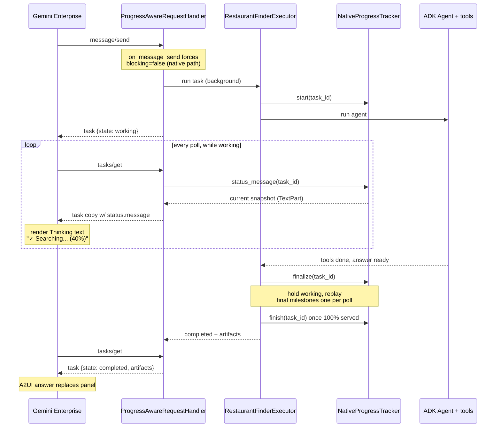
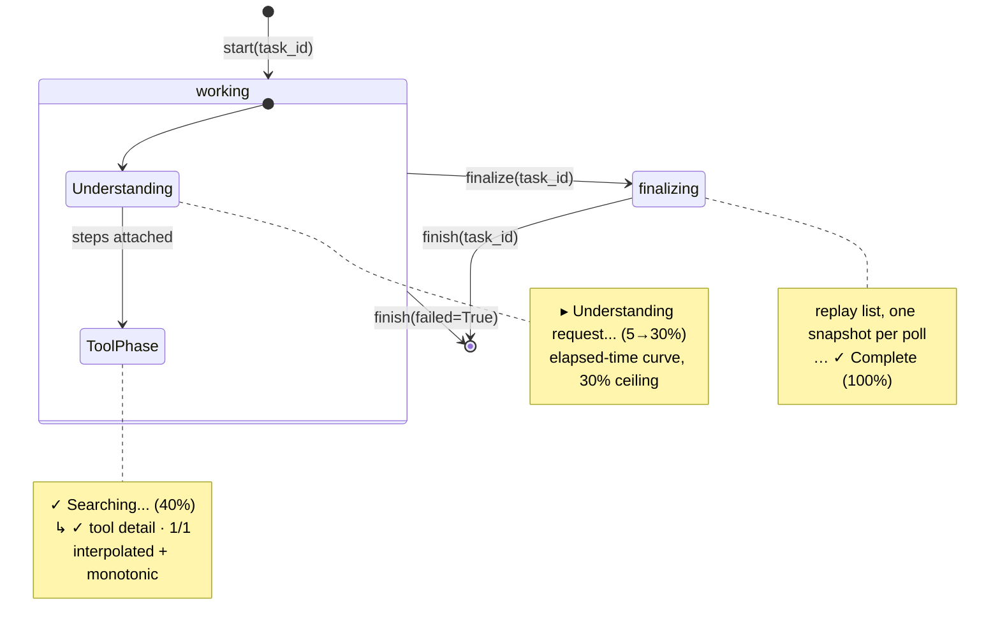

# Gemini Enterprise — "Thinking" Panel Implementation

How the **Gemini Enterprise (GE) native Thinking panel** is implemented in this
repo: the live, step-by-step display GE shows while the agent is working
("Understanding request… → Searching for restaurants… → Compiling dashboard… →
Complete").

> **Scope.** This doc covers only the **GE native** Thinking panel. The custom
> Lit UI uses a different mechanism (metadata on tagged text parts); see
> [`progress_bar.md`](./progress_bar.md) for that path and for response
> enrichment.

---

## TL;DR

- **The Thinking panel is plain text, not A2UI.** GE renders
  `task.status.message` as text on every poll. We never send A2UI
  surfaces/components for progress — only `TextPart` strings like
  `✓ Searching for restaurants... (40%)`. A2UI is used **only** for the final
  answer (artifacts: restaurant lists, maps, charts).
- **It is poll-driven, not streamed.** The agent card advertises
  `capabilities.streaming = false`, so GE uses `message/send` + `tasks/get`
  polling.
- **The displayed stage is computed at read time.** A custom `tasks/get` handler
  asks `NativeProgressTracker` for the *current* stage on each poll, instead of
  relying on whatever `status.message` happens to be stored. This is the core
  trick — see [Why read-time](#why-compute-at-read-time).

---

## High-level flow

GE sends one `message/send` (forced non-blocking), then polls `tasks/get`
repeatedly. The agent runs once in the background; each poll asks the tracker for
the *current* stage and gets a freshly-computed text snapshot — until artifacts
replace the panel.



The two design pillars visible here: **(1)** progress is pulled at read time
(`status_message` per poll), and **(2)** the executor holds the task `working`
after the agent finishes so a fast task's steps aren't skipped.

## Tracker state machine

`NativeProgressTracker` moves a task through three internal states; the snapshot
text differs in each.



## The problem GE poses

GE's Thinking tab is **snapshot-based**, not history-accumulating:

- While the task is not `completed`, GE shows `task.status.message` (the current
  snapshot).
- Once `completed`, GE shows `task.artifacts` and the Thinking tab is replaced.
- GE does **not** accumulate `task.history`; each poll just re-reads the current
  status.

Our agent often finishes within a **single GE poll interval**. If we just emit
`working` status events as work happens, by the time GE polls the stored
`status.message` has already raced to `✓ Complete (100%)` (or the task is already
`completed`). Result: the Thinking tab only ever shows **100%**, as one
non-expandable row.

## Why compute at read time

The fix is to **decouple the displayed stage from event timing**. Instead of
storing whatever progress line fired last, we compute the *current* stage when GE
actually polls, from task-keyed state held in `NativeProgressTracker`. Every
poll — whenever it lands — returns an accurate, time-advanced line.

Responsiveness is still bounded by GE's poll interval (polling is inherently less
dynamic than streaming), but each poll is now correct and the panel shows a real
progression.

---

## Components

All in `app/agent_executor.py` unless noted.

| Piece | Responsibility |
|-------|----------------|
| **Agent card** (`app/agent.py`) | Advertises `capabilities.streaming = false` so GE polls instead of streaming. |
| **`ProgressAwareRequestHandler`** | Custom `DefaultRequestHandler`. Forces native sends non-blocking; rewrites `status.message` at read time during `tasks/get`. |
| **`NativeProgressTracker`** | Task-keyed progress state. Computes the current snapshot string per poll; handles the understanding phase, the tool phase, and the final replay. |
| **`RestaurantFinderExecutor._handle_request`** | Lifecycle: starts the tracker, runs the agent, then holds the task `working` long enough for GE to poll the staged snapshots before completing. |
| **`_MapsKeyEventConverter`** | Builds the live step list from ADK events and shares it with the tracker via `attach_steps` (by reference). |

Wired together in `app/main.py`:

```py
executor = RestaurantFinderExecutor(base_url=AGENT_URL, agent=agent)
request_handler = ProgressAwareRequestHandler(
    agent_executor=executor,
    task_store=tasks.InMemoryTaskStore(),
    native_progress=executor.native_progress,
)
```

---

## 1. Make GE poll: `streaming=false` + force non-blocking

GE only sees intermediate progress if it polls while the task is `working`. Two
prerequisites:

1. **The card advertises polling.** `AgentCapabilities(streaming=False, ...)`
   (`app/agent.py`) steers GE to `message/send` + `tasks/get`.
2. **The send is non-blocking.** A2A `message/send` is *blocking* by default; a
   blocking send returns only the finished task, leaving nothing to poll.
   `ProgressAwareRequestHandler.on_message_send` forces native/default requests
   to `blocking=false` server-side, so GE can poll even if it omits the flag:

```py
async def on_message_send(self, params, context=None):
    metadata = params.message.metadata or {}
    if not metadata.get("a2uiProgress"):  # native/default path only
        config = params.configuration or MessageSendConfiguration()
        config = config.model_copy(update={"blocking": False, "history_length": config.history_length or 100})
        params = params.model_copy(update={"configuration": config})
    return await super().on_message_send(params, context)
```

The `a2uiProgress` opt-in flag (set by the custom Lit client) is the discriminator:
when present, this handler does nothing and the custom UI path runs instead.

## 2. Read-time stage: `on_get_task`

On every `tasks/get`, while the stored task is still `working`, the handler
replaces `status.message` with the tracker's current snapshot. It returns a
**copy** so the stored task is never mutated:

```py
async def on_get_task(self, params, context=None):
    task = await super().on_get_task(params, context)
    if task is None or task.status.state != TaskState.working:
        return task
    message = self._native_progress.status_message(task.id)  # current snapshot
    if message is None:
        return task  # opt-in / not tracked
    new_status = task.status.model_copy(update={"message": message})
    return task.model_copy(update={"status": new_status})
```

If the task isn't being tracked (e.g. the custom Lit opt-in path, where the
tracker is never `start()`ed), `status_message` returns `None` and the stored
task is returned unchanged — so the override is a no-op for that path.

## 3. The snapshot: `NativeProgressTracker.status_message`

`status_message(task_id)` returns one `Message` (a plain `TextPart`) per poll.
It has three phases:

**a. Understanding phase (pre-tool).** Before any tool runs, it climbs gently on
an elapsed-time curve from 5% toward a **30% ceiling** (`_UNDERSTANDING_CEIL_PCT`),
so an early poll never shows a misleading 100%:

```text
▸ Understanding request... (8%)
▸ Understanding request... (15%)
```

**b. Tool phase.** Once the converter has attached live steps,
`_get_estimated_single_line_progress(steps)` interpolates from the active step's
`active_started_at` toward the next tool milestone. When tools finish fast, it
replays completed tool steps one per poll via `_native_tool_step_text`, which
adds the indented detail lines GE renders as sub-rows:

```text
✓ Searching for restaurants... (40%)
    ↳ ✓ Search for restaurants
    Tool calls · 1/1
```

**c. Monotonic guard.** A snapshot must never regress between polls; if a
computed pct is below the last served pct, it's clamped up and the percentage in
the text is rewritten (`_replace_progress_pct`).

Every return path is a bare text message — there is no A2UI in it:

```py
return Message(message_id=uuid.uuid4().hex, role=Role.agent, parts=[Part(root=TextPart(text=text))])
```

## 4. Final replay: don't skip the panel on fast tasks

When the agent finishes, the executor doesn't complete the task immediately —
otherwise a sub-poll-interval task would jump straight to artifacts and GE would
never see the steps. Instead:

- `finalize(task_id)` switches the tracker to a `finalizing` state and builds a
  **replay list** of final milestones (`_build_native_final_replay`) — composing,
  then complete — skipping any tool steps already served, kept monotonic from the
  last pct.
- Each subsequent poll advances **one replay snapshot** (`replay_index`), so GE
  appends them at its own cadence.
- `final_replay_complete(task_id)` flips true once a poll has actually received
  the first `✓ Complete (100%)`, so the executor can complete without emitting
  repeated `Complete` rows.
- `finish(task_id)` stops the override; subsequent polls fall back to the stored
  completed task and its artifacts.

## 5. Executor lifecycle (`_handle_request`)

`RestaurantFinderExecutor` overrides ADK's `_handle_request` (with
`use_legacy=True` so `_prepare_session` still runs). For the native/GE path
(`not session.state[PROGRESS_OPT_IN_KEY]`):

1. **Enqueue an initial `working` status** — `▸ Understanding request... (5%)`.
2. **`native_progress.start(task_id)`** and launch a heartbeat loop
   (`NATIVE_PROGRESS_HEARTBEAT_INTERVAL_SECS = 0.75s`) that keeps the stored
   `status.message` fresh as a fallback. (The `on_get_task` override is the
   authoritative source while polling; the heartbeat is belt-and-suspenders.)
3. **Run the agent.** Each ADK event passes through `_MapsKeyEventConverter`,
   which updates the step list and shares it with the tracker via `attach_steps`.
4. **On success:** `finalize(task_id)`, then hold the task `working` for up to
   `NATIVE_PROGRESS_FINAL_HOLD_SECS = 15.0s`, checking
   `final_replay_complete()` every `NATIVE_PROGRESS_REPLAY_CHECK_SECS = 0.25s`.
   Once the first `100%` snapshot has been served, emit the answer artifacts and
   the final `completed` status. Then `finish(task_id)`.
5. **On exception:** `native_progress.finish(task_id, failed=True)`; the task is
   marked failed.

---

## Example progression (GE-style poll @ 0.4s)

```text
working   ▸ Understanding request... (8%)
working   ▸ Understanding request... (15%)
working   ✓ Searching for restaurants... (40%)
              ↳ ✓ Search for restaurants
              Tool calls · 1/1
working   ✓ Compiling dashboard... (70%)
              ↳ ✓ Render dashboard UI
              Tool calls · 1/1
working   ▸ Composing response... (90%)
working   ✓ Complete (100%)
completed (artifacts rendered)
```

The `↳` and `·` characters and the `(n%)` suffix are just text — GE's native
Thinking UI parses and styles them; we send no structure to drive that.

---

## Constants to tune

| Constant (`app/agent_executor.py`) | Default | Effect |
|------------------------------------|---------|--------|
| `NATIVE_PROGRESS_HEARTBEAT_INTERVAL_SECS` | `0.75` | How often the fallback heartbeat refreshes stored `status.message`. |
| `NATIVE_PROGRESS_FINAL_HOLD_SECS` | `15.0` | Max time to hold `working` so GE can poll the final replay. |
| `NATIVE_PROGRESS_REPLAY_CHECK_SECS` | `0.25` | How often the executor checks whether the `100%` snapshot was served. |
| `NativeProgressTracker._UNDERSTANDING_CEIL_PCT` | `30` | Ceiling for the pre-tool understanding phase. |
| `_native_replay_tool_pcts(count)` | — | Per-tool milestone percentages (1 tool → 70%; 2 → 40/70; 3+ → 40→80 spread). |

---

## Why this works (and its limits)

- **Every poll is correct.** Computing the stage in `on_get_task` makes the
  result independent of how fast events fired — the right model for a
  snapshot-based, append-only Thinking tab.
- **Fast tasks still show steps.** The final replay holds the task `working` and
  advances on poll, so a sub-poll-interval task doesn't skip the panel.
- **Bounded by polling.** Responsiveness can never beat GE's poll interval;
  polling is inherently less dynamic than streaming. The card stays
  `streaming=false` because the read-time + replay design depends on it.
- **No state corruption.** `on_get_task` returns a `model_copy`; the stored task
  is never mutated.

---

## Testing

```sh
uv run pytest tests/unit/agent_executor_test.py        # tracker / replay / monotonic
uv run pytest tests/integration/server_e2e_test.py     # forced non-blocking + tasks/get
```

Manual GE-style poll (server running with a model configured):

```sh
TASK_ID=$(curl -sS -H 'Content-Type: application/json' \
  --data-raw '{"jsonrpc":"2.0","method":"message/send","id":1,"params":{"message":{"messageId":"d1","contextId":"c1","role":"user","kind":"message","parts":[{"kind":"text","text":"tell me about Han Dynasty restaurant"}]}}}' \
  http://127.0.0.1:8011/ | jq -r '.result.id')

# Poll repeatedly — status.message should climb (…%), not jump straight to 100%.
curl -sS -H 'Content-Type: application/json' \
  --data-raw "{\"jsonrpc\":\"2.0\",\"method\":\"tasks/get\",\"id\":2,\"params\":{\"id\":\"$TASK_ID\"}}" \
  http://127.0.0.1:8011/ | jq -r '.result.status | .state, (.message.parts[0].text // "")'
```

After changing capabilities or handler behavior, re-register the GE agent so the
`streaming=false` card is active:

```sh
make register-gemini-enterprise
curl -sS "$AGENT_URL/.well-known/agent-card.json" | jq '.capabilities.streaming'   # expect: false
```

## Common symptoms

- **Jumps straight to 100% / Thinking tab not expandable** → confirm
  `ProgressAwareRequestHandler` is wired in `app/main.py`, that `on_message_send`
  forces native sends to `blocking=false`, and that the registered card has
  `streaming=false`.
- **Repeated `✓ Complete (100%)` rows** → the executor should stop on
  `final_replay_complete()`, not a blind timer.
- **Steps never appear, only understanding/complete** → check that the converter
  is calling `attach_steps` so the tracker sees the live step list.

## Key files

| Area | File |
|------|------|
| Tracker, handler, converter, executor lifecycle | `app/agent_executor.py` |
| Agent card (`streaming=false`) | `app/agent.py` |
| Handler wiring | `app/main.py` |
| Custom Lit UI progress (different path) | [`progress_bar.md`](./progress_bar.md) |
