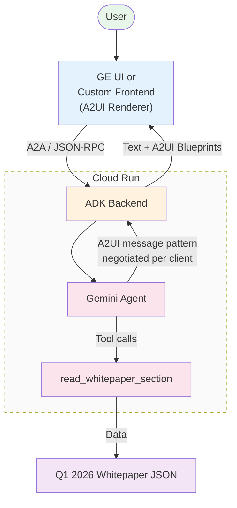
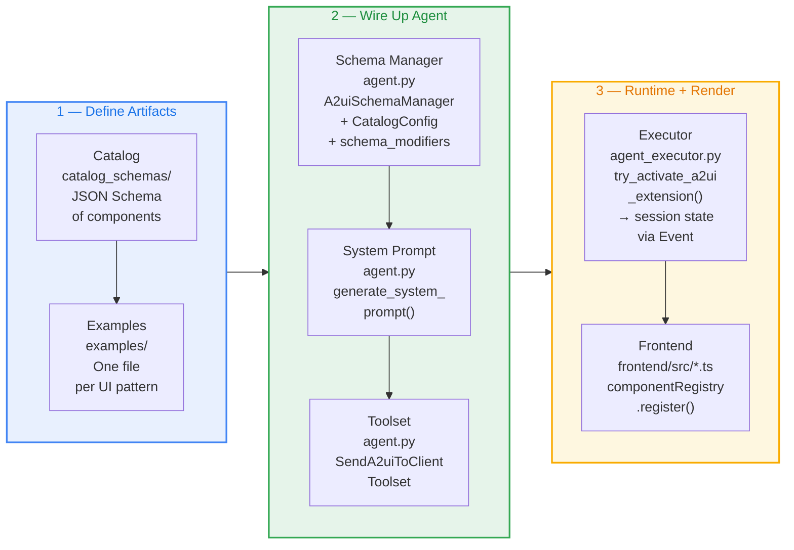
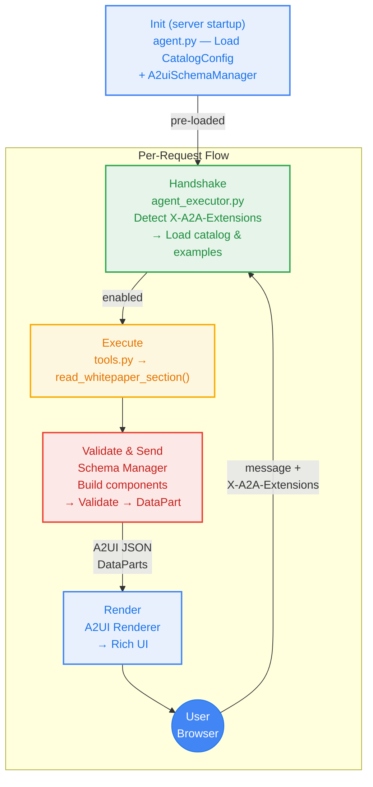

# A developer's guide to Gemini Enterprise and A2UI integration

Audience: Developers building agents on Google Cloud.

If you've built a chatbot, you know this conversation:

> **User:** "What was our lost pipeline last quarter?"
> **Agent:** "We lost $483.46M."
> **User:** "What were the reasons?"
> **Agent:** "IBM did not pursue accounted for $226.26M, Customer did not pursue was $157.61M..."

A chart or a data grid would have ended this in one glance. But until recently, agents had no standard way to render a chart — or a map, or a multi-select list — inside the chat surface they live in. They could only return text.

Today, we're walking through how to fix that with **A2UI**, an open protocol for agent-driven user interfaces, and how to integrate an A2UI-enabled agent with **Gemini Enterprise** so your agent renders rich UI natively in the GE chat surface — and in your own custom frontend if you want one. We'll use a working dashboard agent — built with the Google Agent Development Kit (ADK), the A2A protocol, and Gemini — as the reference. The full source is on [GitHub](https://github.com/wadave/agent-a2ui-demo).

## The problem: agents speak text, but users want UI

Most agent frameworks today return strings. That's fine for short answers, but it breaks down quickly:

- **Choices among options** become long bulleted lists the user has to copy-paste back.
- **Complex data** (sales metrics, forecasts, tables) is reduced to text summaries.

Developers have tried to patch this by sending HTML or JavaScript fragments, but that introduces real risks: cross-site scripting, UI injection from a remote agent you don't fully control, and visual drift from the host app's design system. What's needed is a way to transmit UI that's **safe like data and expressive like code**.

## What A2UI is

[A2UI](https://a2ui.org/) is an open protocol, [introduced by Google](https://developers.googleblog.com/introducing-a2ui-an-open-project-for-agent-driven-interfaces/) and co-developed with the Flutter team and product teams behind Gemini Enterprise. Instead of returning text or HTML, an agent returns a JSON payload that describes a UI: a tree of **components** (Card, Text, Button, ChoicePicker, Image, …) and a separate **data model** holding the values those components display.

Three properties make this useful in practice:

- **Declarative, not executable.** The payload is data. The client only renders components from a pre-approved **catalog**, so a remote agent can't inject arbitrary code or steal credentials through a UI widget.
- **Streaming-friendly.** The format is a flat list of small JSON messages, so the LLM can emit them incrementally and the client can paint as they arrive.
- **Framework-agnostic.** The same agent response renders through Lit, Angular, Flutter, or native mobile. The agent doesn't know — or care — what's on the other end.

A2UI is also **transport-agnostic**. The messages ride inside whatever pipe you already use: A2A JSON-RPC, AG-UI, WebSockets, SSE. In our reference implementation, A2UI rides inside the [A2A protocol](https://a2aprotocol.ai/) as `DataPart` objects with the MIME type `application/json+a2ui`.

### Where A2UI sits in the stack

A2UI is one piece of a four-layer stack. Confusion usually comes from conflating these layers — they're each doing a different job:

| Layer | Owns | Examples |
| --- | --- | --- |
| **App experience** | Client shell and conversation state — chat window, input box, message history | CopilotKit, AG-UI |
| **Pixel drawing** | Turning component descriptions into actual rendered UI | Lit, Flutter, Angular |
| **Conversation pipeline** | Client–server transport — sending messages, receiving responses | A2A Protocol |
| **Cargo (data format)** | The thing flowing through the pipeline that *describes* the UI | A2UI |

Read top to bottom: **CopilotKit/AG-UI** owns the app experience. **Lit/Flutter/Angular** own the rendering. **A2A** owns the pipeline. **A2UI** is the cargo flowing through the pipeline.

That separation is why the same A2UI payload renders identically in three very different deployment shapes:

- **Bespoke web app** — a custom client shell (like the reference repo's Lit `frontend/`) plus a custom A2UI renderer.
- **CopilotKit / AG-UI app** — CopilotKit owns the chat shell, an A2UI renderer is registered inside it for rich cards.
- **Gemini Enterprise** — GE *is* the shell, the renderer, and the transport client. You only build the agent.

### Why CopilotKit and AG-UI don't show up in the Gemini Enterprise integration

If you're integrating with Gemini Enterprise specifically, you can ignore CopilotKit and AG-UI entirely. Two reasons:

1. **GE replaces the shell.** CopilotKit and AG-UI are open-source frameworks for building *your own* chat surface — they give you the input box, message history, and component-routing wiring. Gemini Enterprise already provides all of that as a managed product. Bolting CopilotKit on top would mean shipping a second chat UI inside the GE chat UI.
2. **GE talks A2A directly.** The pipeline GE uses to call your agent is plain A2A JSON-RPC with the A2UI extension negotiated via the `X-A2A-Extensions` header. There's no AG-UI hop in between. Your agent only needs to speak A2A and emit A2UI — GE handles routing, rendering, and turning user interactions back into structured agent inputs.

So for the GE path, the stack collapses to two layers you control: the **A2A endpoint** (your agent) and the **A2UI cargo** it emits. The other two layers are GE's responsibility. CopilotKit and AG-UI are great if you're building a standalone product UI elsewhere — they're just out of scope for embedding an agent inside Gemini Enterprise.

### Pattern revisions

The protocol evolves quickly, and different clients support different revisions. Two patterns are common today:

- **Inline pattern** — the agent sends a component tree with the data baked into each component (the pattern Gemini Enterprise renders today).
- **Decoupled pattern** — the agent sends the component tree and the data model as separate messages, so subsequent turns can update one without re-sending the other. This reduces tokens and latency for long-running conversations and is the direction the protocol is heading.

The reference repo serves **both** patterns from one backend, picking which to emit per request based on the client's `X-A2A-Extensions` header. As new revisions ship, you add another catalog and the same negotiation pattern keeps working.

## How A2UI works inside Gemini Enterprise

Gemini Enterprise ships with a built-in A2UI renderer. For the developer, that means the integration story is short:

1. **Build your A2A agent**, embedding an A2UI catalog and example payloads alongside the regular tool definitions.
2. **Register the agent** with Gemini Enterprise as an A2A endpoint. (Use `make register-gemini-enterprise` in the reference repo.)
3. **A GE admin shares the agent** with employees, just like any other agent in the GE catalog.

At runtime, the flow looks like this:

1. The user types a request in the GE chat. GE calls your agent's A2A endpoint and sends along **GE's own A2UI catalog** — the list of UI components GE knows how to render.
2. Your agent decides whether a UI widget is the right response. If yes, it emits an A2UI JSON message (e.g., a `VegaChart` of sales data). If no, it falls back to text. Both can coexist in the same response.
3. GE receives the JSON, validates it against its catalog, and renders the widget natively in **GE's own design language** — so it visually matches the rest of the chat surface.
4. When the user interacts with the widget (selects three options, picks a date), GE serializes the interaction back into JSON and sends it to your agent as the next turn. Your agent processes structured input, not free-form text.

One thing worth flagging: because your agent doesn't ship its own renderer for GE, you don't need to choose a frontend framework to start. Your A2A endpoint can run anywhere — Cloud Run, GKE, on-prem — and GE handles the rendering.

## High-level architecture example

The reference implementation is an ADK backend on Cloud Run designed to plug seamlessly into Gemini Enterprise.



- Gemini Enterprise connects directly to your agent using standard A2A JSON-RPC calls.
- The agent serves the inline message pattern expected by the Gemini Enterprise managed UI.
- Custom components like `VegaChart` and `DataGrid` are used to render dashboards.

## Implementation guide

The full integration is three phases: **define artifacts** (catalog + examples), **wire up the agent** (schema manager + system prompt + toolset), and **runtime + render** (executor + frontend registry).



### A2UI request lifecycle

End-to-end, here's what happens for a single user request — say, *"What is CQ performance vs budget?"*:



1. **Header detection** — the executor reads the client's `X-A2A-Extensions` header (when present) to pick the matching A2UI message pattern, falling back to GE's expected default if the header is absent.
2. **Schema Manager** — loads the matching catalog (`restaurant_finder_catalog_definition.json`) and example templates into session state.
3. **Tool Execution** — the LLM calls `read_whitepaper_section("cq_performance_vs_budget")`.
4. **Validate & Send** — the agent assembles the layout, the Schema Manager validates the structure, and the result ships as A2A `DataPart` objects.

### Detailed steps

#### Step 1. Define your catalog

Create a catalog JSON with a `catalogId` and a `components` map. Each component uses the **discriminator pattern** — a literal `component` const — and properties reference shared types from `common_types.json`:

```json
{
  "catalogId": "https://example.com/my_catalog.json",
  "components": {
    "MyWidget": {
      "type": "object",
      "allOf": [
        { "$ref": "common_types.json#/$defs/ComponentCommon" },
        {
          "type": "object",
          "properties": {
            "component": { "const": "MyWidget" },
            "title": { "$ref": "common_types.json#/$defs/DynamicString" }
          },
          "required": ["component", "title"]
        }
      ],
      "unevaluatedProperties": false
    }
  }
}
```

You only declare components specific to your domain. The bundled `BasicCatalog` already provides Row, Column, Card, Text, Button, ChoicePicker, TextField, Image, Icon, and friends.

#### Step 2. Create examples

Drop one JSON file per UI pattern into an `examples/` directory. These get injected into the agent's system prompt automatically — they're how the LLM learns what idiomatic A2UI output looks like for *your* catalog. The schema validates structure; examples demonstrate intent.

#### Step 3. Register the catalog in the schema manager

Pin the schema manager to whichever A2UI revision your client speaks.

```python
from a2ui.schema.manager import A2uiSchemaManager
from a2ui.schema.catalog import CatalogConfig
from a2ui.schema.catalog_provider import FileSystemCatalogProvider
from a2ui.schema.common_modifiers import remove_strict_validation
from a2ui.basic_catalog.provider import BasicCatalog

A2UI_VERSION = settings.a2ui_version  # e.g., from env or config

schema_manager = A2uiSchemaManager(
    version=A2UI_VERSION,
    catalogs=[
        CatalogConfig(
            name="my_catalog",
            provider=FileSystemCatalogProvider("catalog_schemas/my_catalog_definition.json"),
            examples_path="examples/my_catalog",
        ),
        BasicCatalog.get_config(version=A2UI_VERSION),
    ],
    accepts_inline_catalogs=True,
    schema_modifiers=[remove_strict_validation],
)
```

#### Step 4. Generate the system prompt

```python
instruction = schema_manager.generate_system_prompt(
    role_description="You are a helpful assistant...",
    workflow_description="1. Analyze the request...",
    ui_description="Use Card for detail views...",
    include_schema=False,
    include_examples=False,
    validate_examples=False,
)
```

#### Step 5. Attach the toolset to your agent

The agent gets one extra tool — `send_a2ui_json_to_client` — alongside its normal domain tools.

```python
from a2ui.adk.send_a2ui_to_client_toolset import SendA2uiToClientToolset

LlmAgent(
    model=model,
    instruction=instruction,
    tools=[
        SendA2uiToClientToolset(
            a2ui_enabled=lambda ctx: ctx.state.get("system:a2ui_enabled", False),
            a2ui_catalog=lambda ctx: ctx.state.get("system:a2ui_catalog"),
            a2ui_examples=lambda ctx: ctx.state.get("system:a2ui_examples"),
        ),
        # ... your domain tools
    ],
)
```

#### Step 6. Activate A2UI in the executor

This is where per-request setup happens. When a request arrives, your A2A executor needs to do four things before handing control to the agent:

1. **Detect** which A2UI message pattern the client supports.
2. **Fall back** to a sensible default when the header is missing.
3. **Select** the matching catalog and load its examples.
4. **Persist** the result into session state.

#### Step 7. Standalone testing and custom frontends (optional)

Gemini Enterprise handles drawing components automatically using its built-in renderer. If you do want to test outside GE — or ship a custom product UI — build your own renderer by pairing each component's schema with a UI element that draws it.
