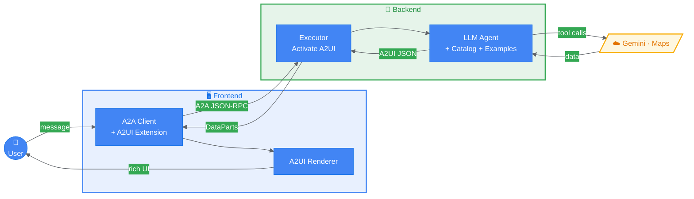
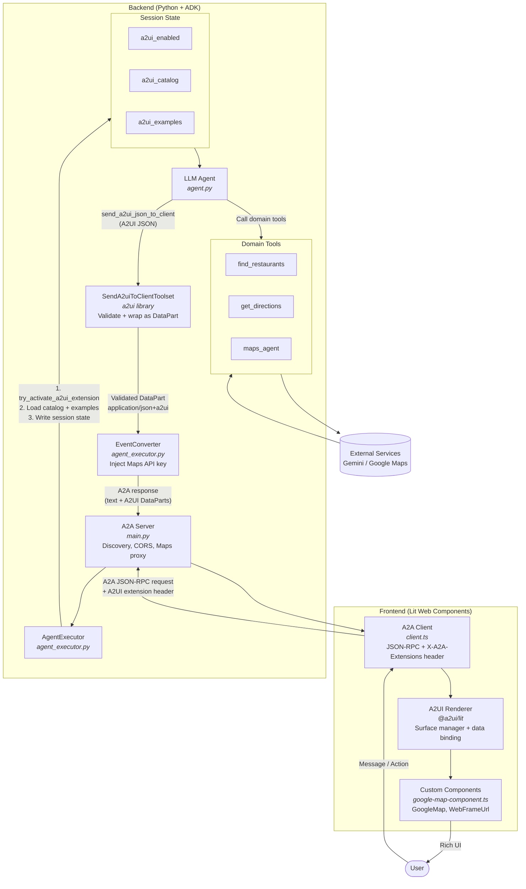
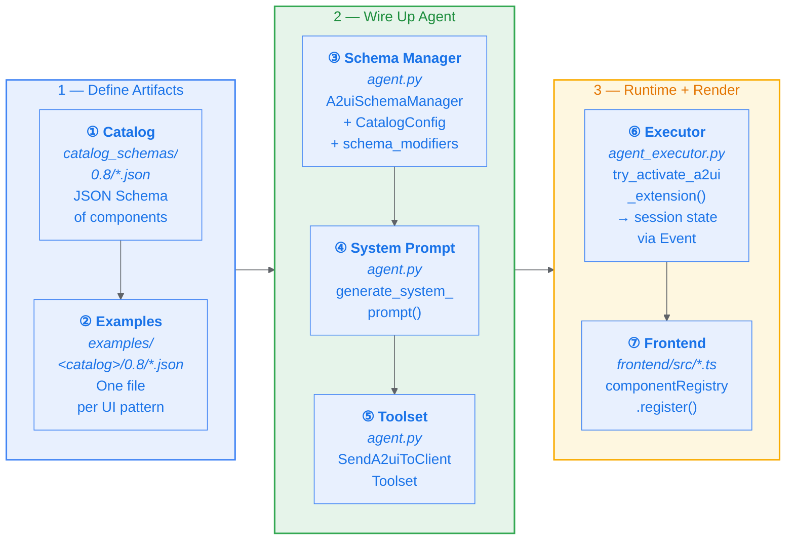
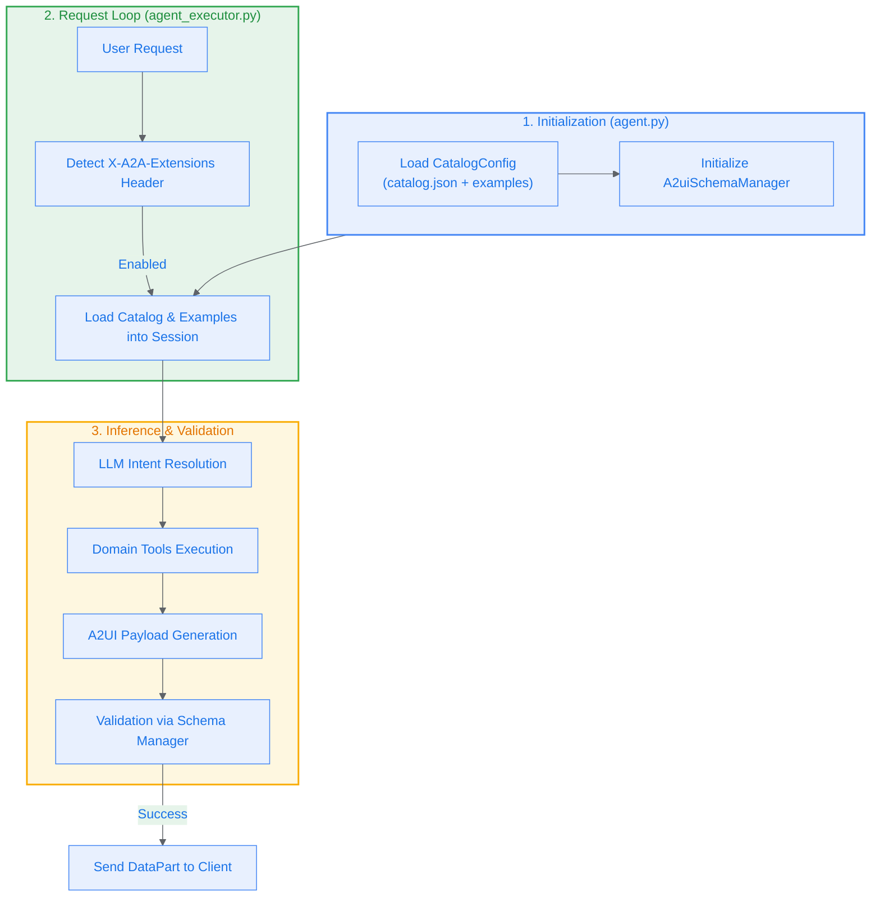

# How to Implement A2UI

## What is A2UI?

A2UI is a protocol for **agent-driven interfaces** ([a2ui.org](https://a2ui.org/)). It enables AI agents to generate rich, interactive UIs that render natively across web, mobile, and desktop — without executing arbitrary code.

Instead of returning plain text, an agent emits a declarative JSON payload describing **surfaces**, **components**, and **data**. A client-side renderer turns that payload into native UI. Because A2UI is a data format (not executable code), agents can only use pre-approved components from a **catalog**, preventing UI injection attacks.

**Key design principles:**

- **LLM-friendly** — flat JSON structure supports incremental/streaming generation
- **Framework-agnostic** — the same agent response renders across Angular, Flutter, React, Lit, native mobile
- **Progressive rendering** — UI updates stream in real time as the agent generates them
- **Secure** — declarative catalog model; no code execution on the client

---

## Versions

| Version | Status | Notes |
|---------|--------|-------|
| **v0.8** | Stable / Production | Used by this repo. Surfaces, components, data binding, adjacency-list model |
| **v0.9** | Draft | Adds `createSurface` (replaces `beginRendering`), `updateComponents` (replaces `surfaceUpdate`), `updateDataModel` (replaces `dataModelUpdate`), common types schema, client-side functions |

This repo uses **v0.8** exclusively. The a2ui library supports both versions.

---

## What You Need

Two artifacts are required to wire up A2UI in an agent:

| Artifact | Purpose |
|---|---|
| **Catalog** (`catalog_definition.json`) | Defines available UI components and their JSON Schemas |
| **Examples** (`*.json` files) | Shows the LLM how to produce valid A2UI messages for each use case |

The `BasicCatalog` from the a2ui library provides standard components for free. Your custom catalog only needs to add app-specific components.

---

## Key Components

### Standard Components (BasicCatalog)

**Layout:**

| Component | Description |
|---|---|
| `Column` | Vertical stack of children (by explicit ID list or data template) |
| `Row` | Horizontal stack of children |
| `List` | Scrollable list (vertical/horizontal), supports data binding via template |
| `Card` | Wraps a single child component in a card surface |
| `Tabs` | Tab container with titled tab items, each containing a child component |
| `Divider` | Horizontal or vertical divider line |

**Content:**

| Component | Description |
|---|---|
| `Text` | Display text with `usageHint` (`h1`-`h5`, `body`, `caption`) |
| `Image` | Display an image by URL with `fit` and `usageHint` options |
| `Icon` | Named icon from a fixed set (e.g. `star`, `locationOn`, `search`) |

**Interactive:**

| Component | Description |
|---|---|
| `Button` | Triggers a named action; passes context key/value pairs back to agent |
| `TextField` | Text input (`shortText`, `longText`, `date`, `number`, `obscured`) |
| `MultipleChoice` | Checkbox or chip selection from options list |

### Custom Components (this repo)

| Component | Description |
|---|---|
| `WebFrameUrl` | Embeds a URL in an iframe (maps, directions, web content) |
| `GoogleMap` | Renders a Google Map with center, zoom, and optional pins |

Custom components are defined in the catalog JSON and registered in the frontend renderer.

---

## Message Types (v0.8)

Each A2UI payload is an **array** of message objects. Each message contains exactly **one** action key. Messages are processed in order:

### 1. `beginRendering`

Initializes a new UI surface. Must come first.

```json
{
  "beginRendering": {
    "surfaceId": "restaurant-map-view",
    "root": "root-column"
  }
}
```

### 2. `surfaceUpdate`

Defines or updates the component tree. Components form an adjacency list — each references children by ID.

```json
{
  "surfaceUpdate": {
    "surfaceId": "restaurant-map-view",
    "components": [
      {
        "id": "root-column",
        "component": {
          "Column": {
            "children": { "explicitList": ["map-header", "map-frame"] }
          }
        }
      },
      {
        "id": "map-header",
        "component": {
          "Text": { "text": { "literalString": "Restaurant Location" }, "usageHint": "h2" }
        }
      },
      {
        "id": "map-frame",
        "component": {
          "WebFrameUrl": { "url": { "literalString": "/maps/embed?mode=place&q=Han+Dynasty" } }
        }
      }
    ]
  }
}
```

### 3. `dataModelUpdate`

Populates the data model. Components bind to this data via `path`.

```json
{
  "dataModelUpdate": {
    "surfaceId": "restaurant-selection-surface",
    "path": "/",
    "contents": [
      { "key": "title", "valueString": "Restaurants Near You" },
      { "key": "items[0].name", "valueString": "Han Dynasty" },
      { "key": "items[0].rating", "valueString": "★★★★☆" },
      { "key": "items[0].address", "valueString": "123 Main St, City, ST 00000" }
    ]
  }
}
```

### 4. `deleteSurface`

Removes a surface from the client.

```json
{
  "deleteSurface": { "surfaceId": "restaurant-map-view" }
}
```

---

## Data Binding

Components can reference values two ways:

- **Literal values** — `{ "literalString": "Hello" }` for static content
- **Data paths** — `{ "path": "/title" }` for values populated by `dataModelUpdate`

List templates use `dataBinding` to loop over an array:

```json
{
  "List": {
    "children": {
      "template": {
        "componentId": "item-card-template",
        "dataBinding": "/items"
      }
    }
  }
}
```

Each item in `/items` becomes the local data context for the template, so `{ "path": "/name" }` resolves relative to each item.

---

## Architecture & Data Flow

### High-Level Overview (one-page)



### Detailed Architecture



---

## A2A Protocol Integration

A2UI is transported over the **A2A (Agent-to-Agent)** protocol via an extension mechanism.

### Discovery

The backend serves `/.well-known/agent-card.json` advertising capabilities:

```json
{
  "capabilities": {
    "extensions": [{
      "uri": "https://a2ui.org/a2a-extension/a2ui",
      "version": "0.8",
      "accepts_inline_catalogs": true,
      "supported_catalog_ids": ["restaurant_finder", "basic"]
    }]
  }
}
```

### Activation

1. Frontend sends `X-A2A-Extensions: https://a2ui.org/a2a-extension/a2ui/v0.8` header
2. Backend calls `try_activate_a2ui_extension()` to detect the header
3. If detected, catalog + examples are loaded into session state
4. `SendA2uiToClientToolset` becomes active (returns `send_a2ui_json_to_client` tool)

### Response Format

A2UI data is returned as A2A `DataPart` objects alongside regular text parts:

```json
{
  "result": {
    "status": {
      "message": {
        "parts": [
          { "kind": "text", "text": "Here are the restaurants:" },
          {
            "kind": "data",
            "data": { "beginRendering": { "surfaceId": "s1", "root": "root" } },
            "metadata": { "mimeType": "application/json+a2ui" }
          },
          {
            "kind": "data",
            "data": { "surfaceUpdate": { "surfaceId": "s1", "components": [...] } },
            "metadata": { "mimeType": "application/json+a2ui" }
          }
        ]
      }
    }
  }
}
```

---

## Implementation Steps

### Workflow Overview



### Schema Manager Workflow



### Detailed Steps


#### Step 1. Define Your Catalog

Create a catalog JSON with a `catalogId` and a `components` map. Each component is a JSON Schema:

```json
{
  "catalogId": "https://example.com/my_catalog.json",
  "components": {
    "MyWidget": {
      "type": "object",
      "required": ["title"],
      "properties": {
        "title": {
          "type": "object",
          "properties": {
            "literalString": { "type": "string" },
            "path": { "type": "string" }
          }
        }
      }
    }
  }
}
```

#### Step 2. Create Examples

Create one JSON file per UI pattern (e.g. `list.json`, `detail.json`). Each file is an array of A2UI messages showing a complete render:

```
beginRendering -> surfaceUpdate -> dataModelUpdate
```

These examples are injected into the agent's system prompt to teach the LLM the correct output format.

#### Step 3. Register Catalog in the Schema Manager

```python
from a2ui.core.schema.manager import A2uiSchemaManager, CatalogConfig
from a2ui.core.schema.common_modifiers import remove_strict_validation
from a2ui.basic_catalog.provider import BasicCatalog

schema_manager = A2uiSchemaManager(
    version="0.8",
    catalogs=[
        CatalogConfig.from_path(
            name="my_catalog",
            catalog_path="catalog_schemas/0.8/my_catalog_definition.json",
            examples_path="examples/my_catalog/0.8",
        ),
        BasicCatalog.get_config(version="0.8"),
    ],
    accepts_inline_catalogs=True,
    schema_modifiers=[remove_strict_validation],
)
```

#### Step 4. Generate the System Prompt

```python
instruction = schema_manager.generate_system_prompt(
    role_description="You are a helpful assistant...",
    workflow_description="1. Analyze the request...",
    ui_description="Use Card for detail views...",
    include_schema=False,
    include_examples=False,  # examples loaded dynamically via session
    validate_examples=False,
)
```

#### Step 5. Attach the Toolset to Your Agent

```python
from a2ui.adk.a2a_extension.send_a2ui_to_client_toolset import SendA2uiToClientToolset

LlmAgent(
    model=model,
    instruction=instruction,
    tools=[
        SendA2uiToClientToolset(
            a2ui_enabled=lambda ctx: ctx.state.get("system:a2ui_enabled", False),
            a2ui_catalog=lambda ctx: ctx.state.get("system:a2ui_catalog"),
            a2ui_examples=lambda ctx: ctx.state.get("system:a2ui_examples"),
        ),
        # ... your domain tools
    ],
)
```

#### Step 6. Activate A2UI in the Executor

In `AgentExecutor._prepare_session()`, detect client support and write catalog + examples into session state:

```python
from a2ui.a2a import try_activate_a2ui_extension
from google.adk.agents.invocation_context import new_invocation_context_id
from google.adk.events.event import Event
from google.adk.events.event_actions import EventActions

active_version = try_activate_a2ui_extension(context, agent_card)
if active_version:
    schema_manager = agent.get_schema_manager(active_version)
    catalog = schema_manager.get_selected_catalog(client_ui_capabilities=capabilities)
    examples = schema_manager.load_examples(catalog, validate=True)

    await runner.session_service.append_event(
        session,
        Event(
            invocation_id=new_invocation_context_id(),
            author="system",
            actions=EventActions(
                state_delta={
                    "system:a2ui_enabled": True,
                    "system:a2ui_catalog": catalog,
                    "system:a2ui_examples": examples,
                }
            ),
        ),
    )
```

#### Step 7. Register Custom Components in the Frontend

For any components in your catalog that aren't in `BasicCatalog`, register them in the frontend renderer:

```typescript
import * as UI from "@a2ui/lit/ui";

UI.componentRegistry.register("WebFrameUrl", WebFrameUrl, "a2ui-webframeurl", {
  type: "object",
  properties: {
    url: { type: "object", properties: { literalString: { type: "string" }, path: { type: "string" } } }
  }
});
```

---

## Project Structure

```
agent-a2ui-demo/
├── app/
│   ├── main.py                          # Entry point, A2A server, maps proxy
│   ├── agent.py                         # Agent definition, system prompt, tools
│   ├── agent_executor.py                # A2A executor, A2UI session setup
│   ├── tools.py                         # find_restaurants, get_directions
│   ├── sub_agents.py                    # maps_agent (Google Maps grounding)
│   ├── prompts.py                       # Restaurant search instructions
│   ├── config.py                        # Environment config (GCP, model, keys)
│   ├── session_keys.py                  # A2UI session state key constants
│   ├── a2ui_examples.py                 # Inline A2UI examples (RESTAURANT_SELECTION_EXAMPLES)
│   ├── a2ui_schema.py                   # A2UI v0.8 JSON schema definition
│   ├── deploy.sh                        # Manual deployment script
│   ├── app_utils/
│   │   ├── telemetry.py                 # OpenTelemetry / tracing setup
│   │   └── typing.py                    # Shared type definitions
│   ├── catalog_schemas/
│   │   └── 0.8/
│   │       └── restaurant_finder_catalog_definition.json
│   └── examples/
│       └── restaurant_finder_catalog/
│           └── 0.8/
│               ├── restaurant_selection.json   # List of restaurant cards
│               ├── map.json                    # Map embed view
│               └── directions.json             # Directions with iframe + link
├── frontend/
│   ├── src/
│   │   ├── app.ts                       # A2UI shell (chat UI, surface renderer)
│   │   ├── client.ts                    # A2A JSON-RPC client with A2UI extension
│   │   ├── google-map-component.ts      # Custom GoogleMap + WebFrameUrl components
│   │   ├── iframe-component.ts          # Older/alternative GoogleMap component
│   │   └── test-standalone.ts           # Test harness
│   ├── index.html
│   └── package.json                     # @a2ui/lit, @a2a-js/sdk, lit
├── lit_internal/                         # GE-internal GoogleMap component
│   └── src/v0_8/ui/custom_components/
│       └── google_map/
│           ├── google_map.ts
│           └── index.ts
├── tests/
├── pyproject.toml                       # a2ui-agent-sdk, google-adk, a2a-sdk
└── Makefile
```

---

## Key Dependencies

**Backend (Python):**

| Package | Purpose |
|---|---|
| `a2ui-agent-sdk` | A2UI protocol library (schema manager, toolset, validation) |
| `google-adk` | Google Agent Development Kit (LlmAgent, Runner, tools) |
| `a2a-sdk` | A2A protocol server (request handling, task store) |

**Frontend (TypeScript):**

| Package | Purpose |
|---|---|
| `@a2ui/lit` | A2UI renderer for Lit web components |
| `@a2a-js/sdk` | A2A JSON-RPC client (listed in package.json but unused; `client.ts` uses raw `fetch()`) |
| `lit` | Web components framework |
