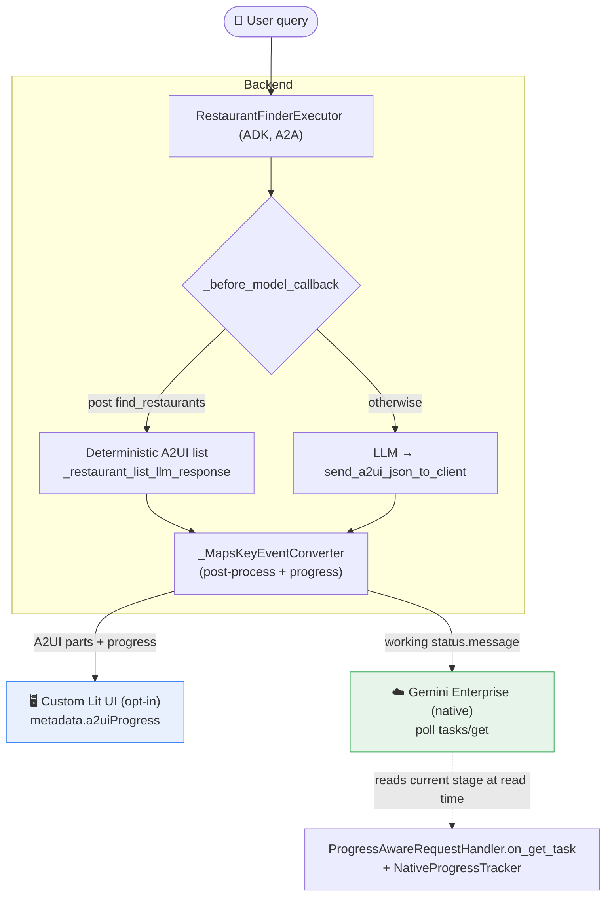

# A2UI Response Enrichment & Thinking / Progress

This document is the single reference for two related pieces of work that make
the demo feel premium across both the **Custom Lit UI** and the **Gemini
Enterprise (GE) native UI**:

1. **Response enrichment** — returning rich, interactive A2UI surfaces
   (restaurant lists, maps, directions, charts/dashboards) for the answer
   itself.
2. **Real‑time thinking steps & progress** — a live "Thinking" display that
   narrates the agent's reasoning and advances a progress percentage while the
   request runs.

> Status: implemented. This doc describes the **current** code. Two points that
> earlier drafts got wrong and are corrected here:
>
> - There is **no** `_TRIGGERS` table / query→template router and **no**
>   LangGraph. The agent is the ADK `RestaurantFinderAgent`; enrichment is
>   produced by the LLM via `send_a2ui_json_to_client` plus one deterministic
>   short‑circuit for restaurant lists.
> - GE's Thinking tab is **snapshot‑based** (`task.status.message` per poll),
>   **not** history‑accumulating. The progression is driven by a custom
>   `tasks/get` handler, not by `message/stream`.

---

## What changed in this repo

This repo now treats GE Thinking as a **polling snapshot** problem instead of a
streaming problem. The important changes are:

1. **Advertise polling, not streaming.** `app/agent.py` sets
   `AgentCapabilities(streaming=False, ...)`, so GE should choose
   `message/send` plus `tasks/get` instead of `message/stream`.
2. **Force native/default sends to non-blocking.**
   `ProgressAwareRequestHandler.on_message_send()` sets
   `configuration.blocking=false` for non-opt-in requests. This matters because
   A2A `message/send` is blocking by default; if GE does not send
   `blocking=false`, it cannot poll while the task is `working`.
3. **Compute GE status at read time.**
   `ProgressAwareRequestHandler.on_get_task()` replaces `task.status.message`
   with the current `NativeProgressTracker` snapshot while the task is
   `working`.
4. **Keep the task working long enough for GE to poll.**
   `RestaurantFinderExecutor._handle_request()` holds completion briefly after
   real work finishes, then emits artifacts and the final `completed` status.
5. **Replay tool-backed milestones when tools finish too fast.**
   `NativeProgressTracker` replays completed tool steps with detail lines such
   as `↳ ✓ Search for restaurants` and `Tool calls · 1/1`, then advances to
   composing and complete.
6. **Stop after the first complete snapshot.**
   `final_replay_complete()` lets the executor complete the task as soon as GE
   has received one `✓ Complete (100%)`, preventing repeated complete rows.
7. **Keep the custom Lit UI separate.** Requests tagged with
   `metadata.a2uiProgress=true` still receive structured progress metadata for
   the rich local progress panel.

## Porting checklist

Use this checklist when applying the same pattern in another A2A/ADK repo:

1. **Agent card**
   - Set `capabilities.streaming=false`.
   - Re-register the GE agent after deployment so GE sees the new card.

2. **Request handler**
   - Replace `DefaultRequestHandler` with a custom handler.
   - Override `on_message_send()` and force native/default requests to
     `MessageSendConfiguration(blocking=False, history_length=100)`.
   - Override `on_get_task()` and, while `task.status.state == working`, return
     a copied task whose `status.message` is the current progress snapshot.

3. **Progress tracker**
   - Track task state by `task_id`.
   - Start at `▸ Understanding request... (5%)`.
   - Attach the live step list as tool events arrive.
   - Return one snapshot per `tasks/get` poll.
   - Keep percentages monotonic; never let a later poll regress.
   - During final replay, advance one snapshot per poll and record when
     `✓ Complete (100%)` has been served.

4. **Executor**
   - Enqueue an initial `TaskStatusUpdateEvent(state=working)`.
   - Run the agent and update progress steps from function calls/responses.
   - On success, call `native_progress.finalize(task_id)`.
   - Hold the task in `working` until the first complete snapshot is served, or
     until a conservative timeout is reached.
   - Then emit the answer artifact and the final `completed` status.

5. **Milestone tuning**
   - Treat percentages as UX milestones, not real progress.
   - In this repo, native completed-tool replay uses:
     - one tool: `70%`
     - two tools: `40%`, `70%`
     - three or more tools: evenly spread from `40%` to `80%`
     - composing: `90%`
     - complete: `100%`
   - Tune `_native_replay_tool_pcts()` and
     `_get_estimated_single_line_progress()` for each repo's common tool
     durations.

6. **Tests**
   - Add a default/native `message/send` integration test that omits
     `blocking=false`, then polls `tasks/get` and verifies a non-terminal
     `status.message` is visible.
   - Add unit tests for monotonic progress, completed-tool replay, high-progress
     final replay, and single complete snapshot behavior.

---

## Architecture



Because A2UI is a declarative, framework‑agnostic protocol, both renderers know
how to draw standard catalog components once received, so **response enrichment
needs no client‑side changes** — it is confined to the backend agent. The
progress display needs small frontend additions only for the **custom Lit UI**;
GE consumes progress natively via polling.

---

# Part 1 — Response Enrichment

## How A2UI surfaces are produced

The agent advertises both A2UI **v0.8** (Gemini Enterprise) and **v0.9** (custom
Lit shell). The active version is negotiated per request in
`RestaurantFinderExecutor._prepare_session` from the `X-A2A-Extensions` header;
when no header is sent (GE), it defaults to **v0.8**.

- The LLM emits surfaces by calling **`send_a2ui_json_to_client`** with a single
  compact `a2ui_json` array. `LenientSendA2uiToClientToolset`
  (`app/agent.py`) tolerates a couple of recoverable JSON mistakes
  (e.g. `[...][...]` concatenation) instead of sending the model into a retry
  loop.
- **Restaurant lists are short‑circuited deterministically.** After a
  `find_restaurants` tool response, `_before_model_callback` returns
  `_restaurant_list_llm_response(...)` (`app/agent.py`), which builds the A2UI
  list itself (v0.8 or v0.9) rather than letting the LLM re‑serialize it. This
  is faster and avoids malformed payloads.
- Maps / directions use a `WebFrameUrl` pointing at the backend
  `/maps/embed` proxy (`app/main.py`), which injects the API key server‑side.
- Charts use **`VegaChart`** for v0.8 and **`Chart`** for v0.9 (see the agent
  prompt's "A2UI Chart for Data" rules). For v0.8 GE, the VegaChart `spec` is a
  **raw** object — not wrapped in `literalObject`.

## Post‑processing of outgoing A2UI parts

`_MapsKeyEventConverter.__call__` cleans every outgoing A2A event
(`app/agent_executor.py`):

| Step | Function | Purpose |
|------|----------|---------|
| Split combined messages | `_split_combined_a2ui_data` | Renderers reject one object carrying multiple update types; emit one per type, surface‑creating types first. |
| Rewrite map URLs | `_replace_proxy_urls` | Turn `/maps/embed?...` into the full Embed API URL with the key. |
| Repair catalog id | `_repair_catalog_id` | Overwrite a hallucinated v0.9 `createSurface.catalogId` with the session's real one. |
| Dedupe answer text | `_dedupe_text_parts_across_events` | Drop repeated answer text ADK emits in multiple containers. |

---

# Part 2 — Thinking Steps & Progress

The two clients consume progress **differently**:

| Client | Transport | What it shows |
|--------|-----------|---------------|
| **Custom Lit UI** | opt‑in: `message/send` + `tasks/get` polling, tagged with `metadata.a2uiProgress: true` | Rich, locally‑animated progress panel rendered from **metadata** on tagged text parts (`a2uiProgressSteps`). |
| **Gemini Enterprise** | native: `message/send` + `tasks/get` polling (no A2UI header) | `task.status.message` while the task is `working`; `task.artifacts` once `completed`. **Snapshot per poll** — it does not accumulate history. |

The agent card advertises **`capabilities.streaming = false`** (`app/agent.py`),
so A2A clients use `message/send` + polling rather than `message/stream`.

## Opt‑in flag

`metadata.a2uiProgress` is set by the custom Lit client (`frontend/src/client.ts`)
and stored on the ADK session in `_prepare_session`:

```py
session.state[PROGRESS_OPT_IN_KEY] = bool((context.message.metadata or {}).get("a2uiProgress") if context.message else False)
```

- **opt‑in true** → custom Lit path (metadata progress).
- **opt‑in false** → GE native path (poll‑driven `status.message`).

## Progress data model

Progress is an ordered list of `steps`, built up as ADK events arrive. Each
internal step (`app/agent_executor.py`):

```py
{
    "title": "Searching for restaurants",
    "detail": "Calling Google Maps to find restaurants near the requested location.",
    "state": "active",  # pending | active | done | failed
    "call_key": ("tool-call-id",),
    "active_started_at": 1234.5,  # time.monotonic() when the step went active
    "tools": [{"name": "find_restaurants", "id": "tool-call-id", "state": "running"}],  # running|done|failed
}
```

Tool names map to friendly labels via `_TOOL_LABELS`; step title/detail pairs
come from `_TOOL_STEP_TITLES`. `_public_progress_steps()` strips internal fields
(`call_key`, `active_started_at`), converts tool names to labels, and adds
`completedTools` / `totalTools` before sending to the custom frontend.

## Event conversion (shared by both paths)

`_MapsKeyEventConverter._advance_steps()` inspects each ADK event part:

- **`function_call`** → starts (or reactivates) a step, records its tools as
  `running`, sets `active_started_at`. Duplicate tool-call events are deduped by
  `call_key`. When `find_restaurants` starts, `_append_pending_dashboard_step()`
  pre‑announces the fast "Compiling dashboard" step so it doesn't flash by.
- **`function_response`** → matches tools (by id, falling back to name), flips
  them to `done`, and marks the step `done` when all its tools settle.
- **final text response** → marks any remaining active tool/step `done`.

## Custom Lit path — metadata on tagged text parts

When opt‑in, `_enrich_with_progress` appends a tagged `TextPart` to the working
status message:

```py
Part(
    root=TextPart(
        text=stage,
        metadata={
            PROGRESS_STAGE_META: True,  # "a2uiProgressStage"
            PROGRESS_STEPS_META: _public_progress_steps(steps),  # "a2uiProgressSteps"
        },
    )
)
```

The client (`frontend/src/client.ts`) detects these with `#isStagePart()`,
replays unseen ones, and calls `onStage(text, progressSteps)`; everything else
stays answer text. The Lit app (`frontend/src/app.ts`) renders the rich panel
and animates the bars locally (see [Frontend rendering](#frontend-rendering)).

## Gemini Enterprise path — poll‑driven (read‑time) progress

**Problem.** GE shows `task.status.message` per poll while `working`. Our agent
often finishes within a single GE poll interval, so intermediate `working`
status updates can be missed: by GE's first poll the stored `status.message`
has already raced to `"✓ Complete (100%)"` (or the task is already
`completed`). Result: the Thinking tab only ever shows **100%**, with a single
(non‑expandable) entry.

**Fix.** Decouple the displayed stage from event timing by computing it **at read
time** in a custom `tasks/get` handler. Two pieces in `app/agent_executor.py`:

- **`NativeProgressTracker`** — task‑keyed progress state. `status_message(task_id)`
  computes the current GE snapshot:
  - Pre‑tool phase: `▸ Understanding request... (n%)`, advancing 5% → a 30%
    ceiling on a gentle elapsed‑time curve (never a misleading 100% on an early
    poll).
  - Tool phase: `_get_estimated_single_line_progress(steps)` interpolates from
    the active step's `active_started_at` toward the next tool milestone.
  - Monotonic across polls (a snapshot never regresses).
  - `finalize()` replays final milestones during the pre‑completion hold. The
    replay includes tool-call detail lines, e.g. `↳ ✓ Search for restaurants`
    and `Tool calls · 1/1`.
  - `final_replay_complete()` flips true once the first `✓ Complete (100%)`
    snapshot has been served, so the executor can complete the task without
    repeated `Complete` rows.
  - `finish()` stops overriding so the completed task/artifacts show.

- **`ProgressAwareRequestHandler(DefaultRequestHandler)`** — overrides
  `on_message_send` and `on_get_task`. For native/default requests, it forces
  `message/send` to `configuration.blocking=false` server-side so GE can start
  polling even if it omits that flag. While the stored task is `working`,
  `on_get_task` replaces `status.message` with the tracker's current stage. It
  returns a `model_copy` so the **stored task is never mutated** (the SDK's
  `apply_history_length` returns the stored object verbatim when no
  `historyLength` is requested).

Wired in `app/main.py`:

```py
executor = RestaurantFinderExecutor(base_url=AGENT_URL, agent=agent)
request_handler = ProgressAwareRequestHandler(
    agent_executor=executor,
    task_store=tasks.InMemoryTaskStore(),
    native_progress=executor.native_progress,
)
```

The handler override is a no‑op for the custom Lit (opt‑in) path: the tracker is
only `start()`ed for non‑opt‑in requests, so `status_message` returns `None` and
the stored task is returned unchanged.

### Executor lifecycle (`RestaurantFinderExecutor._handle_request`)

The executor overrides ADK's `_handle_request` (with `use_legacy=True` so
`_prepare_session` still runs even when GE opts into the new ADK integration):

1. Enqueue an initial `working` status. For GE: `"▸ Understanding request... (5%)"`.
2. For the GE path: `native_progress.start(task_id)` and launch a
   `0.75s` heartbeat (`NATIVE_PROGRESS_HEARTBEAT_INTERVAL_SECS`) that keeps the
   stored `status.message` fresh as a fallback. (The `on_get_task` override is
   the authoritative source while polling; the heartbeat is belt‑and‑suspenders.)
3. Run the agent; each ADK event goes through `_MapsKeyEventConverter`, which
   updates steps and, for GE, shares the live step list with the tracker via
   `attach_steps`.
4. On success: `native_progress.finalize(task_id)`, keep the task in
   `working` for up to `NATIVE_PROGRESS_FINAL_HOLD_SECS = 15.0s`, and advance
   one replay snapshot per GE poll. The executor checks
   `final_replay_complete()` every `NATIVE_PROGRESS_REPLAY_CHECK_SECS = 0.25s`
   and emits artifacts plus final `completed` status as soon as the first
   `100%` snapshot has been served. For the restaurant flow this gives GE polls
   a chance to append tool-backed steps such as search and dashboard rendering
   before the final answer replaces the Thinking tab.
5. On exception: `native_progress.finish(task_id, failed=True)`; the task is
   marked failed.

The final replay matters because a very fast task can otherwise finish between
GE polls and skip the Thinking tab entirely. Replay advances on poll, not on a
blind timer, so GE should not append repeated `✓ Complete (100%)` rows. The
replay still cannot beat the poll interval — **responsiveness is bounded by how
often GE polls** (polling is inherently less dynamic than streaming).

### Verified progression (live, GE‑style poll)

A non‑opt‑in request polled every 0.4s yields, e.g.:

```
working   ▸ Understanding request... (8%)
working   ▸ Understanding request... (15%)
working   ✓ Searching for restaurants... (40%)
              ↳ ✓ Search for restaurants
              Tool calls · 1/1
working   ✓ Compiling dashboard... (70%)
              ↳ ✓ Render dashboard UI
              Tool calls · 1/1
working   ▸ Composing response... (90%)
working   ✓ Complete (100%)
completed (artifacts rendered)
```

## Frontend rendering (custom Lit UI)

File: `frontend/src/app.ts` (treat it as the source of truth for numeric tuning).

- State: `ProgressStep { title, detail?, state, tools[], completedTools,
  totalTools, visualStartedAt? }`. `visualStartedAt` is frontend‑only and keeps
  the local animation smooth across repeated backend updates.
- `startProgressTimer()` shows an immediate local "Understanding request" step at
  5% before the first backend event arrives.
- `updateProgressFromMetadata(steps)` normalizes backend steps and merges timing
  (`mergeProgressStepTiming`), preserving `visualStartedAt` for active steps.
- The overall bar is computed from **aggregate tool completion** when tools are
  known (so milestones like 50% are visible), falling back to weighted‑step /
  elapsed‑time progress otherwise. Active steps cap at 95% until the backend
  marks them done. Key constants: `OVERALL_PROGRESS_START=5`,
  `OVERALL_PROGRESS_MAX=98`, `MIN_PROGRESS_UPDATE_VISIBLE_MS`,
  `MIN_FINAL_STEP_VISIBLE_MS`, `COMPLETION_HOLD_MS`.
- `renderProgressPanel()` / `renderProgressStep()` / `renderStepToolProgress()`
  draw the panel: per‑step title/detail, tool rows with markers, a determinate
  per‑step bar, and a state label.

### Legacy A2UI progress‑surface path (compatibility only)

An older design rendered progress by sending a full A2UI **surface**
(`tool-progress-*`) every tick. The builders still exist
(`_tool_progress_messages`, `_tool_progress_messages_v0_9`,
`_progress_status_parts`) but are **not** on the live path. The frontend keeps a
compatibility parser (`processLiveA2UI → updateProgressFromA2UI →
extractProgressSteps`, gated by `isProgressA2UIMessage`) so historical surfaces
don't render as answer content. **New progress work should use the metadata path
(custom UI) and `NativeProgressTracker` (GE), not the surface builders.**

---

## Why this design

- **Enrichment stays isolated.** The final A2UI answer is produced once; progress
  never reuses that surface path, so the two cannot interfere.
- **GE progress is pull‑based.** Computing the stage in `on_get_task` makes every
  poll correct regardless of how fast events fired — the right model for a
  snapshot‑based, append‑only Thinking tab.
- **Custom UI is metadata‑driven + locally animated.** Compact metadata keeps
  updates cheap; the frontend smooths the bars even when backend events are
  sparse.

---

## Adding a new tool step

1. Add a label in `_TOOL_LABELS` (`app/agent_executor.py`).
2. Add a `(title, detail)` pair in `_TOOL_STEP_TITLES`.
3. If the tool is reliably followed by a short fast step, pre‑announce it like
   `_append_pending_dashboard_step()`.
4. Add a frontend estimate in `getStepEstimatedMs()` and, if common/long, a
   weight in `getStepWeight()` (`frontend/src/app.ts`).
5. For GE, if the step needs a custom time estimate, extend the title checks in
   `_get_estimated_single_line_progress()`.
6. Add/adjust unit tests in `tests/unit/agent_executor_test.py`.

---

## Testing & debugging

```sh
# Unit tests (fast, deterministic)
uv run pytest tests/unit/agent_executor_test.py
# Frontend build
npm run build
git diff --check
```

## Deployment and GE registration

After changing agent capabilities, request handling, or polling behavior:

1. Deploy the backend.
2. Re-register the GE agent so the card with `streaming=false` is active:

   ```sh
   make register-gemini-enterprise
   ```

3. Verify the served card:

   ```sh
   curl -sS "$AGENT_URL/.well-known/agent-card.json" | jq '.capabilities.streaming'
   ```

   Expected value: `false`.

4. Verify the native/default polling path by sending a non-opt-in
   `message/send` request without `configuration.blocking=false`, then polling
   `tasks/get`. The server should force native/default sends onto the polling
   path and return a non-terminal task before completion.

## Test coverage

- `tests/unit/agent_executor_test.py`
  - native tracker understanding phase
  - live tool-step progress
  - monotonic progress
  - final replay milestones with tool-call details
  - high-progress final replay does not skip tool steps
  - tracker cleanup
- `tests/integration/server_e2e_test.py`
  - default/native `message/send` is forced onto the polling path
  - explicit non-blocking `message/send` plus `tasks/get`
  - working `task.status.message` visibility before completion
  - agent card advertises `streaming=false`

Inspect the **GE poll path** end‑to‑end (server must be running with a model
configured, e.g. Vertex via ADC: `GOOGLE_GENAI_USE_VERTEXAI=true`,
`GOOGLE_CLOUD_PROJECT`, `GOOGLE_CLOUD_LOCATION`). Send a **non‑opt‑in**
request, then poll `tasks/get` and watch `status.message` advance. The server
forces native/default sends to non‑blocking mode, so the debug request can omit
`configuration.blocking=false`:

```sh
PORT=8011 python -m uvicorn app.main:app --host 127.0.0.1 --port 8011 &

TASK_ID=$(curl -sS -H 'Content-Type: application/json' \
  -H 'X-A2A-Extensions: https://a2ui.org/a2a-extension/a2ui/v0.8' \
  --data-raw '{"jsonrpc":"2.0","method":"message/send","id":1,"params":{"message":{"messageId":"d1","contextId":"c1","role":"user","kind":"message","parts":[{"kind":"text","text":"tell me about Han Dynasty restaurant"}]}}}' \
  http://127.0.0.1:8011/ | jq -r '.result.id')

# Poll a few times — status.message should climb (…%), not jump straight to 100%.
curl -sS -H 'Content-Type: application/json' \
  --data-raw "{\"jsonrpc\":\"2.0\",\"method\":\"tasks/get\",\"id\":2,\"params\":{\"id\":\"$TASK_ID\"}}" \
  http://127.0.0.1:8011/ | jq -r '.result.status | .state, (.message.parts[0].text // "")'
```

For the **custom Lit (opt‑in) path**, add `"metadata":{"a2uiProgress":true}` to
the message and grep the polled task JSON for `a2uiProgressSteps`.

Common symptoms:

- **GE jumps straight to 100% / Thinking tab not expandable** → check that
  `ProgressAwareRequestHandler` is wired in `app/main.py`, that its
  `on_message_send` override is forcing native/default sends to
  `blocking=false`, and that the registered agent card has `streaming=false`.
- **Overall bar jumps mid→100 (custom UI)** → tune `getStepWeight()` /
  `getStepEstimatedMs()`.
- **Progress text leaks into the answer (custom UI)** → ensure `#isStagePart()`
  sees `a2uiProgressStage: true`.

## Key files

| Area | File |
|------|------|
| Executor, converter, tracker, handler | `app/agent_executor.py` |
| Agent, prompts, deterministic list, agent card | `app/agent.py` |
| App wiring, maps proxy, CORS | `app/main.py` |
| Custom UI client (opt‑in, polling) | `frontend/src/client.ts` |
| Custom UI rendering & animation | `frontend/src/app.ts` |
| Unit tests | `tests/unit/agent_executor_test.py` |
