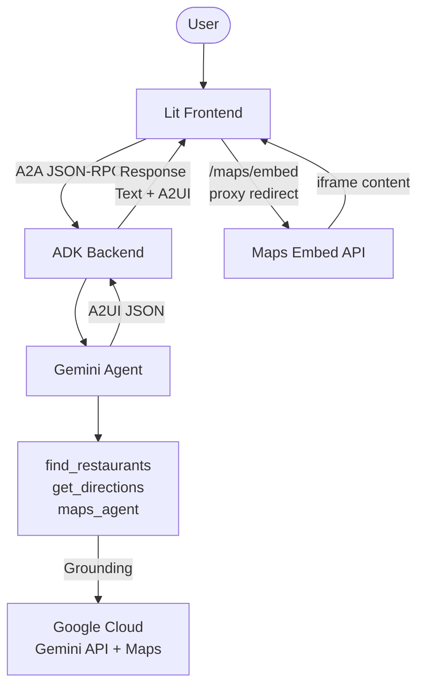
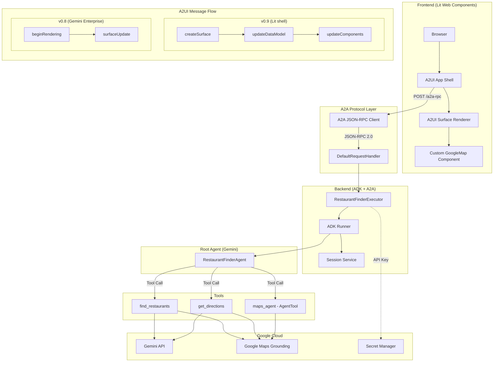
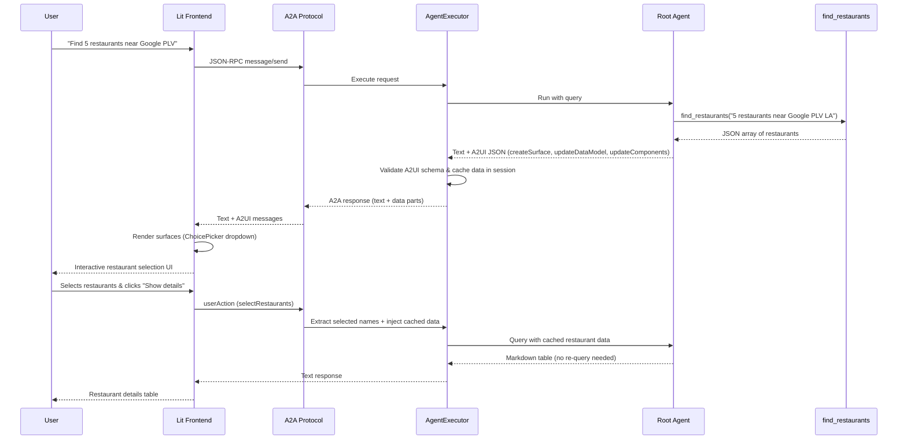

# Software Design Document (SDD): A2UI Restaurant Finder Demo

**Document Metadata**
- **Title:** Software Design Document (SDD) - A2UI Restaurant Finder Demo
- **Version:** 1.0
- **Status:** Approved / Production-Ready
- **Date:** April 24, 2026
- **Author:** Antigravity (Senior Software Engineer)
- **Repository:** [agent-a2ui-demo](./)

---

## 1. Executive Summary

### 1.1. Purpose & Scope
This document details the software design for the **A2UI Restaurant Finder Demo**, a production-grade reference implementation demonstrating the integration of the **Google Agent Development Kit (ADK)**, the **Agent-to-Agent (A2A) Protocol**, and the **Agent-driven User Interface (A2UI)** specification.

The system addresses the critical challenge of providing rich, interactive, and stateful user interfaces in LLM-powered chat applications. It showcases how a single backend can dynamically serve different UI generations: **A2UI v0.9** (featuring the "save-then-render" pattern) to a custom Lit-based web shell, and **A2UI v0.8** (featuring inline component data) to Gemini Enterprise (GE), all while maintaining strict data consistency and security.

### 1.2. Key Capabilities
- **Dual-Version A2UI Support:** Seamlessly negotiates between A2UI v0.8 and v0.9 based on client capabilities (`X-A2A-Extensions` header).
- **Stateful Data Binding (v0.9):** Implements the advanced `updateDataModel` and `updateComponents` pattern, decoupling UI structure from data payloads and enabling data reuse across turns.
- **Custom Component Rendering:** Ships inline definitions for rich components, specifically `GoogleMap` and `WebFrameUrl`, enabling native rendering of interactive maps and directions within standard chat streams.
- **Google Maps Grounding:** Leverages Google Maps API for real-time location grounding, restaurant search, and routing.
- **Production-Grade Robustness:** Implements interceptors to automatically repair common LLM hallucinations (e.g., combined A2UI messages, invalid catalog IDs).
- **Security-First Architecture:** Utilizes Google Cloud Secret Manager for API keys and an internal proxy URL pattern to prevent API key exposure to the LLM.

---

## 2. System Architecture

The system implements a decoupled, N-tier architecture separating the user interface, protocol translation, agent orchestration, and external tool execution.

### 2.1. High-Level Architecture
The following diagram illustrates the high-level component boundaries and network interactions.

### 2.2. Detailed Architecture & Component Breakdown
The system is divided into four primary logical tiers: Frontend, A2A Protocol, Backend (ADK), and External Services.

### 2.3. Tier Responsibilities

#### 2.3.1. Frontend Tier ([frontend/](../frontend))
- **`app.ts` (App Shell):** Hosts the main chat interface, manages user input, and renders the conversation history.
- **`client.ts`:** Implements the A2A JSON-RPC client, encapsulating transport logic and header management (`X-A2A-Extensions`).
- **`google-map-component.ts`:** Implements custom Lit web components for `GoogleMap` and `WebFrameUrl`. These components intercept A2UI payloads and render native iframes using the Google Maps Embed API.

#### 2.3.2. A2A Protocol Tier ([app/main.py](../app/main.py))
- **`DefaultRequestHandler`:** The entry point for A2A JSON-RPC 2.0 messages. It parses incoming `message/send` and `userAction` requests and routes them to the appropriate executor.
- **Content Negotiation:** Inspects the `X-A2A-Extensions` header to determine the A2UI capabilities of the client.

#### 2.3.3. Backend Tier ([app/](../app))
- **`RestaurantFinderExecutor` (`agent_executor.py`):** Overrides the standard `A2aAgentExecutor` to inject session state, determine the active A2UI version, and apply custom event converters.
- **`_MapsKeyEventConverter` (`agent_executor.py`):** A post-processing interceptor that acts as a "safety ramp" and "hallucination repair" layer. It transforms LLM output into strictly compliant A2UI messages before transmission.
- **`ADK Runner`:** The core ADK execution engine that manages agent invocation, tool calling, and state persistence.
- **`Session Service`:** Manages conversation history and persistent session state (`VertexAiSessionService`).

#### 2.3.4. Agent & Tools Tier ([app/agent.py](../app/agent.py), [app/tools.py](../app/tools.py))
- **`RestaurantFinderAgent`:** The root Gemini agent. Configured with specialized system instructions (prompts) and A2UI examples tailored to the negotiated version.
- **`tools.py`:** Defines Python functions exposed to the agent via ADK `@tool` annotations.
    - `find_restaurants`: Searches for restaurants using location data.
    - `get_directions`: Retrieves transit/driving directions.
- **`sub_agents.py`:** Defines the `maps_agent`, a specialized sub-agent utilizing the `GoogleMapsGroundingTool` for precise location lookups.

---

## 3. Data Flow & Protocol Integration

### 3.1. End-to-End Message Flow
The following sequence diagram illustrates the data flow for a complex interaction where the user asks for restaurants, selects one, and the agent utilizes cached session data to provide details without re-querying the underlying tool.

### 3.2. A2UI Version Negotiation
The backend serves two A2UI versions from a single codebase by inspecting the client's request headers.

1.  **Client Request:** The custom Lit shell includes the header:
    `X-A2A-Extensions: https://a2aprotocol.ai/extensions/a2ui/v0.9`
    Gemini Enterprise (GE) omits this header but natively supports v0.8.
2.  **Backend Interception:** `RestaurantFinderExecutor._prepare_session` runs `try_activate_a2ui_extension`.
3.  **Fallback Logic:** If no extension is activated (GE case), the executor explicitly falls back to `v0.8` and registers the v0.8 extension URI.
4.  **Catalog Loading:** The executor loads the corresponding JSON schemas from `app/catalog_schemas/0.8/` or `app/catalog_schemas/0.9/`.
5.  **Prompt Injection:** The agent is dynamically prompted with A2UI examples specific to the active version, sourced from `app/examples/restaurant_finder_catalog/`.

### 3.3. Message Structure: v0.8 vs v0.9
The system supports two distinct rendering patterns:

#### A2UI v0.8 (Gemini Enterprise)
Uses an inline, component-centric approach. Data is embedded directly within the component definitions.
- **`beginRendering`:** Initializes the surface.
- **`surfaceUpdate`:** Sends the entire component tree, including the data (e.g., the restaurant list is hardcoded into the `ChoicePicker` items array).

#### A2UI v0.9 (Custom Lit Shell)
Uses a model-view-viewmodel (MVVM) approach, separating structure from data.
- **`createSurface`:** Initializes the surface and specifies the `catalogId`.
- **`updateDataModel`:** Populates a centralized JSON data model for the surface.
- **`updateComponents`:** Sends the component tree, where component properties use **data binding expressions** (e.g., `{{$data.restaurants}}`) to reference the data model.

*Key Benefit of v0.9:* Enables granular updates. The agent can update the data model via `updateDataModel` in subsequent turns without re-sending the entire component tree, significantly reducing token usage and latency.

---

## 4. Detailed Component Design

### 4.1. Backend: `RestaurantFinderExecutor`
Located in `app/agent_executor.py`, this class is the architectural linchpin. It subclasses `A2aAgentExecutor` and enforces `use_legacy=True` to maintain compatibility with Gemini Enterprise's session setup requirements.

**Key Method: `_prepare_session`**
1.  Calls `try_activate_a2ui_extension` to detect client capabilities.
2.  Applies the v0.8 fallback if necessary.
3.  Retrieves the `active_ui_version` and loads the matching `schema_manager`.
4.  Initializes the base session via `super()._prepare_session`.
5.  Extracts client capabilities and selects the appropriate catalog.
6.  Loads and validates A2UI examples.
7.  **State Injection:** Appends a system event to the session containing `A2UI_ENABLED_KEY: True`, the catalog, and the validated examples. This ensures the downstream `send_a2ui_json_to_client` toolset has access to the correct context.

### 4.2. Backend: `_MapsKeyEventConverter`
This class intercepts the stream of events generated by the agent and post-processes them before they are converted to A2A protocol messages. It solves three critical operational challenges:

1.  **Message Splitting (`_split_combined_a2ui_data`):** The LLM frequently hallucinates by combining `createSurface`, `updateComponents`, and `updateDataModel` into a single JSON object. The A2UI v0.9 specification strictly requires these to be separate messages. The converter detects bundled messages and splits them into a list of individual, single-action messages, preserving the correct execution order.
2.  **URL Rewriting (`_replace_proxy_urls`):** The LLM is instructed to generate proxy URLs for maps (e.g., `/maps/embed?q=Paris`). The converter recursively scans all string values in the A2UI payload, identifies these proxy URLs, and expands them into full Google Maps Embed API URLs, securely injecting the API key retrieved from Secret Manager.
3.  **Catalog ID Repair (`_repair_catalog_id`):** The LLM occasionally hallucinates the `catalogId` in `createSurface` (e.g., using `"restaurant_finder:v0.9"` instead of the full URL). The converter overwrites any invalid `catalogId` with the valid URL registered in the session state, preventing frontend rendering failures.

### 4.3. Custom A2UI Components
To support rich maps and directions, the system defines two custom components in the A2UI catalogs (`app/catalog_schemas/`):

#### `GoogleMap`
- **Description:** Renders an interactive Google Map using the Maps Embed API.
- **Properties:**
    - `q` (string, required): The location query or address.
    - `mode` (string, optional): `place` (default), `view`, `directions`, `search`, `streetview`.
    - `zoom` (number, optional): Zoom level.
    - `maptype` (string, optional): `roadmap` or `satellite`.

#### `WebFrameUrl`
- **Description:** A specialized iframe container for rendering external web content securely.
- **Properties:**
    - `url` (string, required): The URL to embed (rewritten by the backend).
    - `width` (string, optional): e.g., `"100%"`.
    - `height` (string, optional): e.g., `"400px"`.

---

## 5. Security Architecture

The system adheres to the **Zero-Trust Security** principles outlined in `GEMINI.md`, focusing on the principle of least privilege and preventing the leakage of sensitive credentials.

### 5.1. Secret Management
- **No Hardcoded Secrets:** The Google Maps API Key is *never* stored in source code, environment variables in production, or configuration files.
- **Secret Manager Integration:** The key is stored in Google Cloud Secret Manager as `google_map_api_key`.
- **Runtime Retrieval:** The backend (`app/config.py` and `app/agent_executor.py`) retrieves the key at runtime using the `google-cloud-secret-manager` SDK.
- **Local Development Fallback:** For local development *only*, the system supports loading the key from a local `.env` file (which is gitignored).

### 5.2. API Key Exposure Prevention (Proxy Pattern)
Exposing the Google Maps API Key to the LLM (Gemini) in system prompts or examples introduces a severe security risk (credential leakage via prompt injection). To prevent this:
1.  **LLM Prompting:** The agent is strictly instructed to generate a *proxy URL* when it wants to display a map, using the format: `/maps/embed?mode=place&q=<location>`.
2.  **LLM Ignorance:** The LLM never sees or handles the actual API key.
3.  **Backend Interception:** As detailed in Section 4.2, the `_MapsKeyEventConverter` intercepts the A2UI payload *after* the LLM has generated it.
4.  **Secure Injection:** The backend replaces the proxy URL with the full, authenticated URL: `https://www.google.com/maps/embed/v1/place?key=AIzaSy...&q=<location>`.
5.  **Secure Transmission:** The key is transmitted over HTTPS directly to the client, where the browser loads the iframe.

### 5.3. Input & Schema Validation
- **Schema Enforcement:** All A2UI messages generated by the agent are validated against the JSON schemas defined in `app/catalog_schemas/`.
- **Strict Types:** The v0.9 schema (`app/a2ui_schema.py`) strictly enforces that exactly one action key is present, preventing malformed payloads from reaching the client.
- **A2A Validation:** The A2A framework validates incoming JSON-RPC 2.0 requests, ensuring structural integrity before processing.

---

## 6. Operational Excellence

### 6.1. Session Management
- **Persistence:** The system uses ADK's `SessionService` (backed by `VertexAiSessionService` in production) to maintain conversation state.
- **Context Injection:** As shown in the data flow, user selections (`userAction`) are processed by the executor, which re-injects the relevant cached data from the session back into the agent's context, enabling the agent to answer questions about specific entities without re-running expensive tools.

### 6.2. Robustness & Error Handling
- **Hallucination Mitigation:** The `_MapsKeyEventConverter` provides a critical safety layer, actively repairing LLM output (splitting messages, fixing catalog IDs) rather than failing fast and degrading the user experience.
- **Graceful Degradation:** If the Google Maps API key is missing from Secret Manager, the URL rewriting gracefully fails, leaving the proxy URL intact, which the frontend displays as a non-interactive link rather than crashing.

### 6.3. Observability
- **Structured Logging:** The system uses standard Python `logging` configured for Google Cloud Logging compatibility.
- **A2A Inspector:** The system includes an A2A Protocol Inspector (`make inspector`) for debugging JSON-RPC traffic in real-time during development.
- **ADK Playground:** A local playground (`make playground`) allows isolated testing of agent prompts and tool execution.

---

## 7. Verification & Deployment

### 7.1. Testing Strategy
The repository enforces a comprehensive testing strategy via `Makefile` commands:
- **Unit Tests (`make test`):** Validates individual components, including `_split_combined_a2ui_data`, `_replace_proxy_urls`, and tool functions.
- **Code Quality (`make lint`):** Enforces standards using `ruff` for linting and formatting, and `pre-commit` hooks to prevent commits containing secrets (`.secrets.baseline`).
- **Agent Evaluation (`make eval`):** Runs automated evaluations using LLM-as-a-Judge to verify the quality and accuracy of the agent's responses and tool selection.

### 7.2. Deployment & Infrastructure
- **Infrastructure as Code:** The `deployment/` directory contains Terraform configurations for provisioning the necessary GCP infrastructure (Cloud Run, Secret Manager, IAM roles).
- **Containerization:** The `Dockerfile` defines a multi-stage build for the Python backend and the compiled Lit frontend.
- **Cloud Run:** The application is deployed to Cloud Run (`make deploy`), providing automatic scaling and HTTPS endpoints.
- **Identity-Aware Proxy (IAP):** Supports deployment behind IAP (`make deploy IAP=true`) for secure, authenticated enterprise access.
- **CI/CD:** `.cloudbuild/` contains configurations for automated build, test, and deployment pipelines.

---

## 8. References
- **ADK Documentation:** [https://google.github.io/adk-docs/](https://google.github.io/adk-docs/)
- **A2A Protocol Specification:** [https://a2aprotocol.ai/](https://a2aprotocol.ai/)
- **A2UI Repository:** [https://github.com/google/A2UI](https://github.com/google/A2UI)
- **Internal Documentation:**
    - [Authentication Guide](../docs/auth.md)
    - [Schema Manager Details](../docs/how_schema_manager_work.md)
    - [A2UI Introduction](../docs/intro_a2ui.md)
