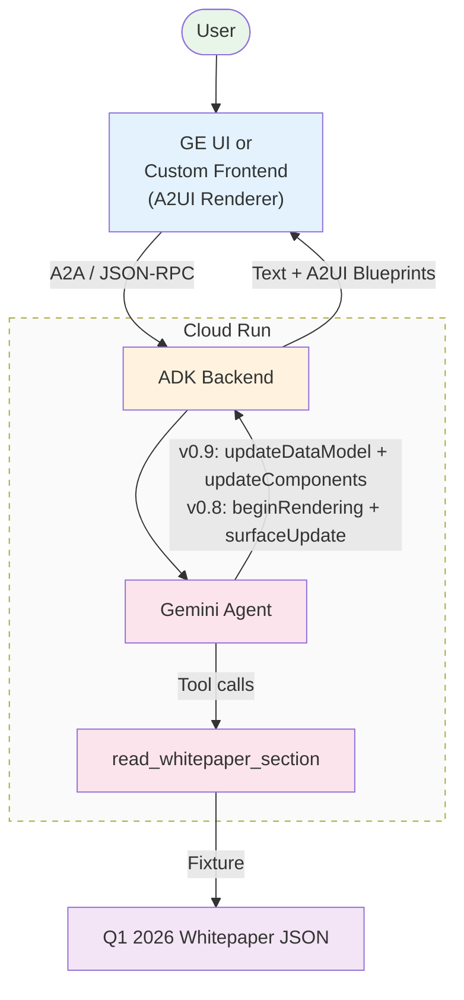
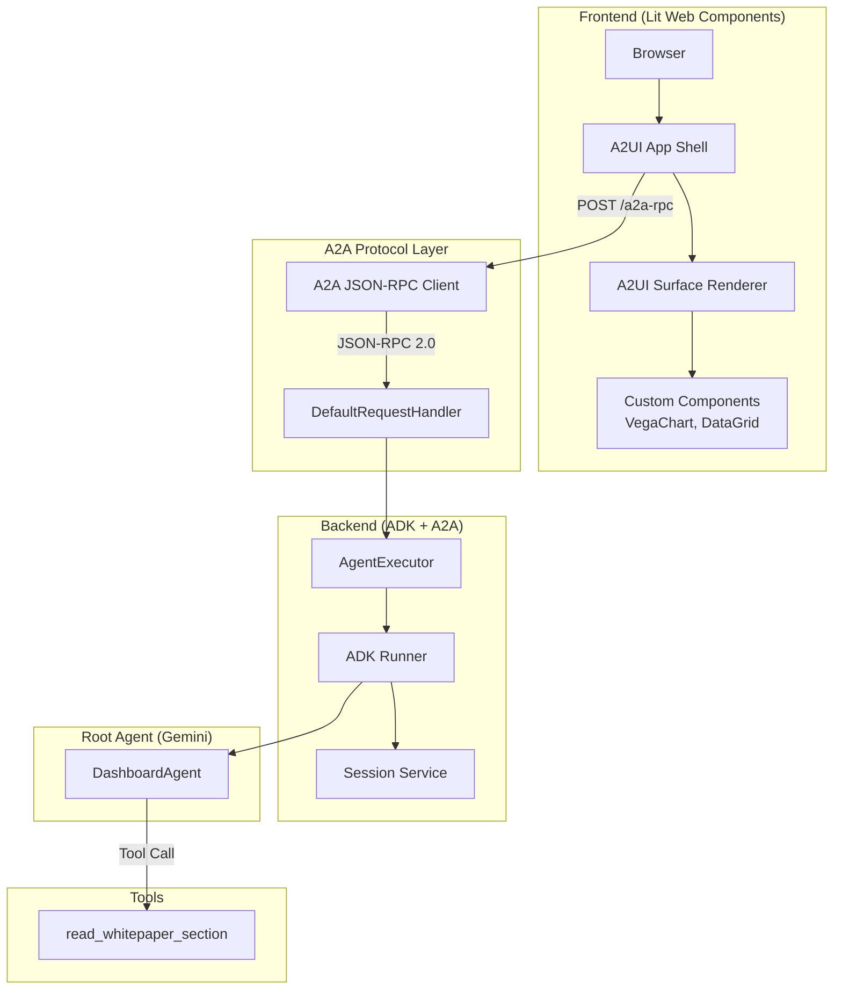
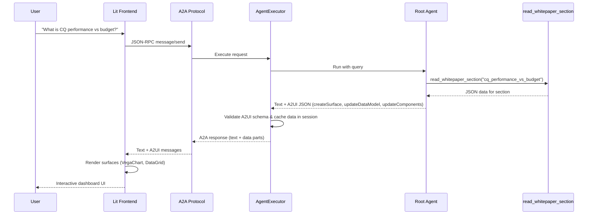

# Software Design Document (SDD): A2UI Dashboard Agent Demo

**Document Metadata**
- **Title:** Software Design Document (SDD) - A2UI Dashboard Agent Demo
- **Version:** 1.1
- **Status:** Approved / Production-Ready
- **Date:** April 30, 2026
- **Author:** Antigravity (Senior Software Engineer)
- **Repository:** [agent-a2ui-demo](./)

---

## Table of Contents
- [1. Executive Summary](#1-executive-summary)
  - [1.1. Purpose & Scope](#11-purpose--scope)
  - [1.2. Key Capabilities](#12-key-capabilities)
- [2. System Architecture](#2-system-architecture)
  - [2.1. High-Level Architecture](#21-high-level-architecture)
  - [2.2. Detailed Architecture & Component Breakdown](#22-detailed-architecture--component-breakdown)
  - [2.3. Tier Responsibilities](#23-tier-responsibilities)
- [3. Data Flow & Protocol Integration](#3-data-flow--protocol-integration)
  - [3.1. End-to-End Message Flow](#31-end-to-end-message-flow)
  - [3.2. A2UI Version Negotiation](#32-a2ui-version-negotiation)
- [4. Detailed Component Design](#4-detailed-component-design)
  - [4.1. Backend: AgentExecutor](#41-backend-agentexecutor)
  - [4.2. Custom A2UI Components](#42-custom-a2ui-components)
- [5. Security Architecture](#5-security-architecture)
  - [5.1. Input & Schema Validation](#51-input--schema-validation)
- [6. Operational Excellence](#6-operational-excellence)
  - [6.1. Session Management](#61-session-management)
  - [6.2. Observability](#62-observability)
- [7. Verification & Deployment](#7-verification--deployment)
  - [7.1. Testing Strategy](#71-testing-strategy)
  - [7.2. Deployment & Infrastructure](#72-deployment--infrastructure)
- [8. References](#8-references)

---

## 1. Executive Summary

### 1.1. Purpose & Scope
This document details the software design for the **A2UI Dashboard Agent Demo**, a production-grade reference implementation demonstrating the integration of the **Google Agent Development Kit (ADK)**, the **Agent-to-Agent (A2A) Protocol**, and the **Agent-driven User Interface (A2UI)** specification.

The system addresses the critical challenge of providing rich, interactive, and stateful user interfaces in LLM-powered chat applications. It showcases how a single backend can dynamically serve different UI generations: **A2UI v0.9** to a custom Lit-based web shell, and **A2UI v0.8** to Gemini Enterprise (GE), all while maintaining strict data consistency and security.

### 1.2. Key Capabilities
- **Dual-Version A2UI Support:** Seamlessly negotiates between A2UI v0.8 and v0.9 based on client capabilities (`X-A2A-Extensions` header).
- **Custom Component Rendering:** Uses `VegaChart` and `DataGrid` components to render complex sales dashboards.
- **Whitepaper Data Integration:** Leverages a Q1 2026 whitepaper fixture as the data source for dashboards.

---

## 2. System Architecture

The system implements a decoupled, N-tier architecture separating the user interface, protocol translation, agent orchestration, and external tool execution.

### 2.1. High-Level Architecture

### 2.2. Detailed Architecture & Component Breakdown

### 2.3. Tier Responsibilities

#### 2.3.1. Frontend Tier
- **`app.ts`:** Hosts the main chat interface.
- **`vega-chart-component.ts`:** Renders Vega charts.
- **`data-grid-component.ts`:** Renders sortable data grids.

#### 2.3.2. A2A Protocol Tier
- Handles JSON-RPC communication and version negotiation.

#### 2.3.3. Backend Tier
- Orchestrates the agent and tools.

---

## 3. Data Flow & Protocol Integration

### 3.1. End-to-End Message Flow

---

## 4. Detailed Component Design

### 4.1. Backend: `AgentExecutor`
Manages session state and A2UI version negotiation.

### 4.2. Custom A2UI Components
- **`VegaChart`:** Renders Vega-Lite specifications.
- **`DataGrid`:** Renders sortable tables with type-aware formatting.

---

## 5. Security Architecture

### 5.1. Input & Schema Validation
Enforces schema validation for all A2UI messages.

---

## 6. Operational Excellence

### 6.1. Session Management
Maintains conversation state using ADK session services.

---

## 7. Verification & Deployment

### 7.1. Testing Strategy
Includes unit tests, integration tests, and E2E tests.

### 7.2. Deployment & Infrastructure
Deployable to Cloud Run using Terraform.
