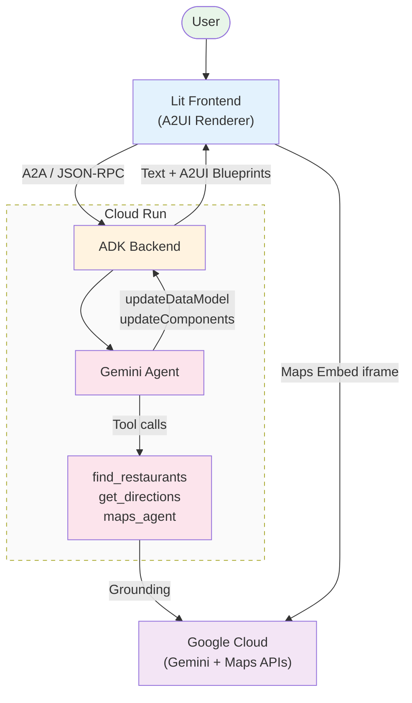

# System Diagram

```mermaid
graph TB
    User([User]) --> FE["Lit Frontend\n(A2UI Renderer)"]

    FE -->|"A2A / JSON-RPC"| BE

    subgraph CloudRun["Cloud Run"]
        BE["ADK Backend"]
        Agent["Gemini Agent"]
        Tools["find_restaurants\nget_directions\nmaps_agent"]

        BE --> Agent
        Agent -->|"Tool calls"| Tools
        Agent -->|"updateDataModel\nupdateComponents"| BE
    end

    BE -->|"Text + A2UI Blueprints"| FE
    Tools -->|"Grounding"| GCP["Google Cloud\n(Gemini + Maps APIs)"]
    FE -->|"Maps Embed iframe"| GCP

    style User fill:#e8f5e9
    style FE fill:#e3f2fd
    style BE fill:#fff3e0
    style Agent fill:#fce4ec
    style Tools fill:#fce4ec
    style GCP fill:#f3e5f5
    style CloudRun stroke-dasharray:5 5,fill:#fafafa
```
